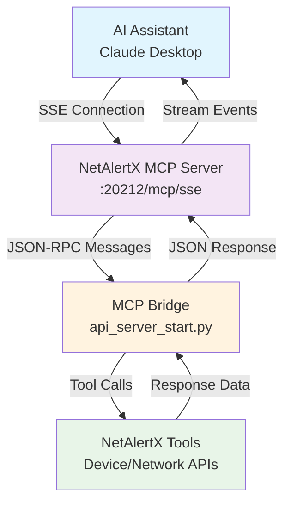
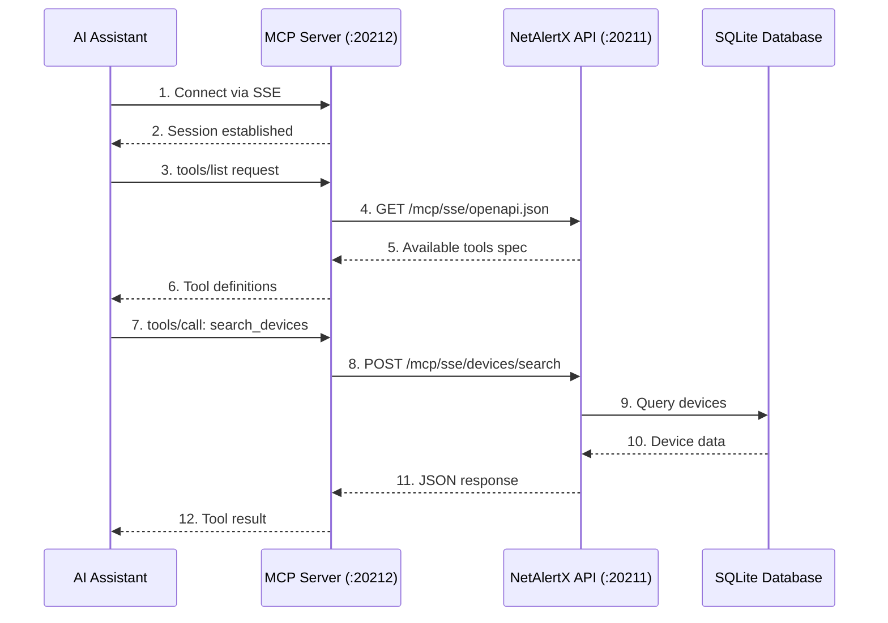
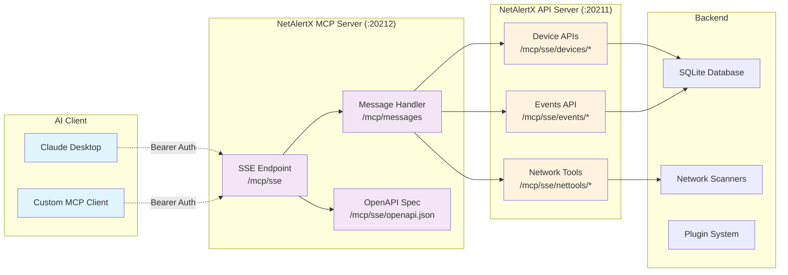

# MCP Server Bridge API

The **MCP (Model Context Protocol) Server Bridge** provides AI assistants with standardized access to NetAlertX functionality through tools and server-sent events. This enables AI systems to interact with your network monitoring data in real-time.

---

## Overview

The MCP Server Bridge exposes NetAlertX functionality as **MCP Tools** that AI assistants can call to:

- Search and retrieve device information
- Trigger network scans
- Get network topology and events
- Wake devices via Wake-on-LAN
- Access open port information
- Set device aliases

All MCP endpoints mirror the functionality of standard REST endpoints but are optimized for AI assistant integration.

---

## Architecture Overview

### MCP Connection Flow



### MCP Tool Integration



### Component Architecture



---

## Authentication

MCP endpoints use the same **Bearer token authentication** as REST endpoints:

```http
Authorization: Bearer <API_TOKEN>
```

Unauthorized requests return HTTP 403:

```json
{
  "success": false,
  "message": "ERROR: Not authorized",
  "error": "Forbidden"
}
```

---

## MCP Connection Endpoint

### Server-Sent Events (SSE)

* **GET/POST** `/mcp/sse`

  Main MCP connection endpoint for AI clients. Establishes a persistent connection using Server-Sent Events for real-time communication between AI assistants and NetAlertX.

**Connection Example**:

```javascript
const eventSource = new EventSource('/mcp/sse', {
  headers: {
    'Authorization': 'Bearer <API_TOKEN>'
  }
});

eventSource.onmessage = function(event) {
  const response = JSON.parse(event.data);
  console.log('MCP Response:', response);
};
```

---

## OpenAPI Specification

### Get MCP Tools Specification

* **GET** `/mcp/sse/openapi.json`

  Returns the OpenAPI specification for all available MCP tools, describing the parameters and schemas for each tool.

**Response**:

```json
{
  "openapi": "3.0.0",
  "info": {
    "title": "NetAlertX Tools",
    "version": "1.1.0"
  },
  "servers": [{"url": "/"}],
  "paths": {
    "/devices/by-status": {
      "post": {"operationId": "list_devices"}
    },
    "/device/{mac}": {
      "post": {"operationId": "get_device_info"}
    },
    "/devices/search": {
      "post": {"operationId": "search_devices"}
    }
  }
}
```

---

## Available MCP Tools

### Device Management Tools

| Tool | Endpoint | Description |
|------|----------|-------------|
| `list_devices` | `/mcp/sse/devices/by-status` | List devices by online status |
| `get_device_info` | `/mcp/sse/device/<mac>` | Get detailed device information |
| `search_devices` | `/mcp/sse/devices/search` | Search devices by MAC, name, or IP |
| `get_latest_device` | `/mcp/sse/devices/latest` | Get most recently connected device |
| `set_device_alias` | `/mcp/sse/device/<mac>/set-alias` | Set device friendly name |

### Network Tools

| Tool | Endpoint | Description |
|------|----------|-------------|
| `trigger_scan` | `/mcp/sse/nettools/trigger-scan` | Trigger network discovery scan |
| `get_open_ports` | `/mcp/sse/device/open_ports` | Get stored NMAP open ports for device |
| `wol_wake_device` | `/mcp/sse/nettools/wakeonlan` | Wake device using Wake-on-LAN |
| `get_network_topology` | `/mcp/sse/devices/network/topology` | Get network topology map |

### Event & Monitoring Tools

| Tool | Endpoint | Description |
|------|----------|-------------|
| `get_recent_alerts` | `/mcp/sse/events/recent` | Get events from last 24 hours |
| `get_last_events` | `/mcp/sse/events/last` | Get 10 most recent events |

---

## Tool Usage Examples

### Search Devices Tool

**Tool Call**:
```json
{
  "jsonrpc": "2.0",
  "id": "1",
  "method": "tools/call",
  "params": {
    "name": "search_devices",
    "arguments": {
      "query": "192.168.1"
    }
  }
}
```

**Response**:
```json
{
  "jsonrpc": "2.0",
  "id": "1",
  "result": {
    "content": [
      {
        "type": "text",
        "text": "{\n  \"success\": true,\n  \"devices\": [\n    {\n      \"devName\": \"Router\",\n      \"devMac\": \"AA:BB:CC:DD:EE:FF\",\n      \"devLastIP\": \"192.168.1.1\"\n    }\n  ]\n}"
      }
    ],
    "isError": false
  }
}
```

### Trigger Network Scan Tool

**Tool Call**:
```json
{
  "jsonrpc": "2.0",
  "id": "2",
  "method": "tools/call",
  "params": {
    "name": "trigger_scan",
    "arguments": {
      "type": "ARPSCAN"
    }
  }
}
```

**Response**:
```json
{
  "jsonrpc": "2.0",
  "id": "2",
  "result": {
    "content": [
      {
        "type": "text",
        "text": "{\n  \"success\": true,\n  \"message\": \"Scan triggered for type: ARPSCAN\"\n}"
      }
    ],
    "isError": false
  }
}
```

### Wake-on-LAN Tool

**Tool Call**:
```json
{
  "jsonrpc": "2.0",
  "id": "3",
  "method": "tools/call",
  "params": {
    "name": "wol_wake_device",
    "arguments": {
      "devMac": "AA:BB:CC:DD:EE:FF"
    }
  }
}
```

---

## Integration with AI Assistants

### Claude Desktop Integration

Add to your Claude Desktop `mcp.json` configuration:

```json
{
  "mcp": {
    "servers": {
      "netalertx": {
        "command": "node",
        "args": ["/path/to/mcp-client.js"],
        "env": {
          "NETALERTX_URL": "http://your-server:<GRAPHQL_PORT>",
          "NETALERTX_TOKEN": "your-api-token"
        }
      }
    }
  }
}
```

### Generic MCP Client

```python
import asyncio
import json
from mcp import ClientSession, StdioServerParameters
from mcp.client.stdio import stdio_client

async def main():
    # Connect to NetAlertX MCP server
    server_params = StdioServerParameters(
        command="curl",
        args=[
            "-N", "-H", "Authorization: Bearer <API_TOKEN>",
            "http://your-server:<GRAPHQL_PORT>/mcp/sse"
        ]
    )

    async with stdio_client(server_params) as (read, write):
        async with ClientSession(read, write) as session:
            # Initialize connection
            await session.initialize()

            # List available tools
            tools = await session.list_tools()
            print(f"Available tools: {[t.name for t in tools.tools]}")

            # Call a tool
            result = await session.call_tool("search_devices", {"query": "router"})
            print(f"Search result: {result}")

if __name__ == "__main__":
    asyncio.run(main())
```

---

## Error Handling

MCP tool calls return structured error information:

**Error Response**:
```json
{
  "jsonrpc": "2.0",
  "id": "1",
  "result": {
    "content": [
      {
        "type": "text",
        "text": "Error calling tool: Device not found"
      }
    ],
    "isError": true
  }
}
```

**Common Error Types**:
- `401/403` - Authentication failure
- `400` - Invalid parameters or missing required fields
- `404` - Resource not found (device, scan results, etc.)
- `500` - Internal server error

---

## Notes

* MCP endpoints require the same API token authentication as REST endpoints
* All MCP tools return JSON responses wrapped in MCP protocol format
* Server-Sent Events maintain persistent connections for real-time updates
* Tool parameters match their REST endpoint equivalents
* Error responses include both HTTP status codes and descriptive messages
* MCP bridge automatically handles request/response serialization

---

## Related Documentation

* [Main API Overview](API.md) - Core REST API documentation
* [Device API](API_DEVICE.md) - Individual device management
* [Devices Collection API](API_DEVICES.md) - Bulk device operations
* [Network Tools API](API_NETTOOLS.md) - Wake-on-LAN, scans, network utilities
* [Events API](API_EVENTS.md) - Event logging and monitoring