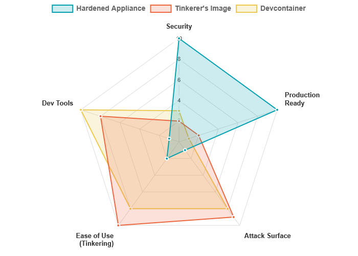

# NetAlertX Builds: Choose Your Path

NetAlertX provides different installation methods for different needs. This guide helps you choose the right path for security, experimentation, or development.

## 1. Hardened Appliance (Default Production)

> [!NOTE]
> Use this image if: You want to use NetAlertX securely.

### Who is this for?

All users who want a stable, secure, "set-it-and-forget-it" appliance.

### Methodology

- Multi-stage Alpine build
- Aggressively "amputated"
- Locked down for max security

### Source

`Dockerfile (hardened target)`

## 2. "Tinkerer's" Image (Insecure VM-Style)

> [!NOTE]
> Use this image if: You want to experiment with NetAlertX.

### Who is this for?

Power users, developers, and "tinkerers" wanting a familiar "VM-like" experience.

### Methodology

- Traditional Debian build
- Includes full un-hardened OS
- Contains `apt`, `sudo`, `git`

### Source

`Dockerfile.debian`

## 3. Contributor's Devcontainer (Project Developers)

> [!NOTE]
> Use this image if: You want to develop NetAlertX itself.

### Who is this for?

Project contributors who are actively writing and debugging code for NetAlertX.

### Methodology

- Builds `FROM runner` stage
- Loaded by VS Code
- Full debug tools: `xdebug`, `pytest`

### Source

`Dockerfile (devcontainer target)`

# Visualizing the Trade-Offs

This chart compares the three builds across key attributes. A higher score means "more of" that attribute. Notice the clear trade-offs between security and development features.

# Build Process & Origins

The final images originate from two different files and build paths. The main `Dockerfile` uses stages to create *both* the hardened and development container images.

## Official Build Path

Dockerfile -> builder (Stage 1) -> runner (Stage 2) ->  hardened (Final Stage) (Production Image) + devcontainer (Final Stage) (Developer Image)

## Legacy Build Path

Dockerfile.debian -> "Tinkerer's" Image (Insecure VM-Style Image)
