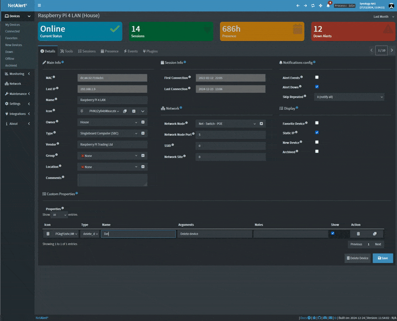

# Custom Properties for Devices

## Overview

This functionality allows you to define **custom properties** for devices, which can store and display additional information on the device listing page. By marking properties as "Show", you can enhance the user interface with quick actions, notes, or external links.

### Key Features:
- **Customizable Properties**: Define specific properties for each device.
- **Visibility Control**: Choose which properties are displayed on the device listing page.
- **Interactive Elements**: Include actions like links, modals, and device management directly in the interface.

---

## Usage on the Device Listing Page

Visible properties (`CUSTPROP_show: true`) are displayed as interactive icons in the device listing. Each icon can perform one of the following actions based on the `CUSTPROP_type`:

1. **Modals (e.g., Show Notes)**:
   - Displays detailed information in a popup modal.
   - Example: Firmware version details.

2. **Links**:
   - Redirect to an external or internal URL.
   - Example: Open a device's documentation or external site.

3. **Device Actions**:
   - Manage devices with actions like delete.
   - Example: Quickly remove a device from the network.

4. **Plugins**:
   - Future placeholder for running custom plugin scripts.
   - **Note**: Not implemented yet.

---

## Example Use Cases

1. **Device Documentation Link**:
   - Add a custom property with `CUSTPROP_type` set to `link` or `link_new_tab` to allow quick navigation to the external documentation of the device.

2. **Firmware Details**:
   - Use `CUSTPROP_type: show_notes` to display firmware versions or upgrade instructions in a modal.

3. **Device Removal**:
   - Enable device removal functionality using `CUSTPROP_type: delete_dev`.

---

## Defining Custom Properties

Custom properties are structured as a list of objects, where each property includes the following fields:

| Field             | Description                                                                 |
|--------------------|-----------------------------------------------------------------------------|
| `CUSTPROP_icon`    | The icon (Base64-encoded HTML) displayed for the property.                 |
| `CUSTPROP_type`    | The action type (e.g., `show_notes`, `link`, `delete_dev`).                |
| `CUSTPROP_name`    | A short name or title for the property.                                    |
| `CUSTPROP_args`    | Arguments for the action (e.g., URL or modal text).                        |
| `CUSTPROP_notes`   | Additional notes or details displayed when applicable.                    |
| `CUSTPROP_show`    | A boolean to control visibility (`true` to show on the listing page).      |

---

## Available Action Types

- **Show Notes**: Displays a modal with a title and additional notes.
  - **Example**: Show firmware details or custom messages.
- **Link**: Redirects to a specified URL in the current browser tab. (**Arguments** Needs to contain the full URL.)
- **Link (New Tab)**: Opens a specified URL in a new browser tab. (**Arguments** Needs to contain the full URL.)
- **Delete Device**: Deletes the device using its MAC address.
- **Run Plugin**: Placeholder for executing custom plugins (not implemented yet).

---

## Notes

- **Plugin Functionality**: The `run_plugin` action type is currently not implemented and will show an alert if used.
- **Custom Icons (Experimental 🧪)**: Use Base64-encoded HTML to provide custom icons for each property. You can add your icons in Setttings via the `CUSTPROP_icon` settings
- **Visibility Control**: Only properties with `CUSTPROP_show: true` will appear on the listing page.

This feature provides a flexible way to enhance device management and display with interactive elements tailored to your needs.
