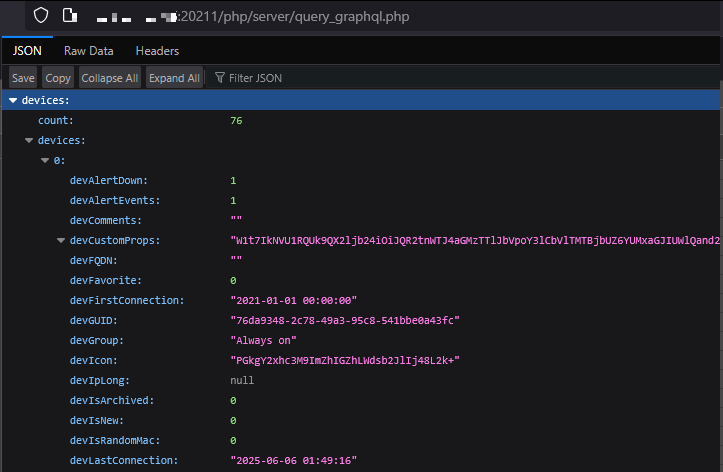

# Debugging GraphQL server issues

The GraphQL server is an API middle layer, running on it's own port specified by `GRAPHQL_PORT`, to retrieve and show the data in the UI. It can also be used to retrieve data for custom third party integarions. Check the [API documentation](./API.md) for details.

The most common issue is that the GraphQL server doesn't start properly, usually due to a **port conflict**. If you are running multiple NetAlertX instances, make sure to use **unique ports** by changing the `GRAPHQL_PORT` setting. The default is `20212`.

## How to update the `GRAPHQL_PORT` in case of issues

As a first troubleshooting step try changing the default `GRAPHQL_PORT` setting. Please remember NetAlertX is running on the host so any application uising the same port will cause issues.

### Updating the setting via the Settings UI

Ideally use the Settings UI to update the setting under General -> Core -> GraphQL port:


You might need to temporarily stop other applications or NetAlertX instances causing conflicts to update the setting. The `API_TOKEN` is used to authenticate any API calls, including GraphQL requests.

### Updating the `app.conf` file

If the UI is not accessible, you can directly edit the `app.conf` file in your `/config` folder:


### Using a docker variable

All application settings can also be initialized via the `APP_CONF_OVERRIDE` docker env variable.

```yaml
...
 environment:
      - PORT=20213
      - APP_CONF_OVERRIDE={"GRAPHQL_PORT":"20214"}
...
```

## How to check the GraphQL server is running?

There are several ways to check if the GraphQL server is running.

### Init Check

You can navigate to System Info -> Init Check to see if `isGraphQLServerRunning` is ticked:


### Checking the Logs

You can navigate to Maintenance -> Logs and search for `graphql` to see if it started correctly and serving requests:


### Inspecting the Browser console

In your browser open the dev console (usually F12) and navigate to the Network tab where you can filter GraphQL requests (e.g., reload the Devices page).


You can then inspect any of the POST requests by opening them in a new tab.




