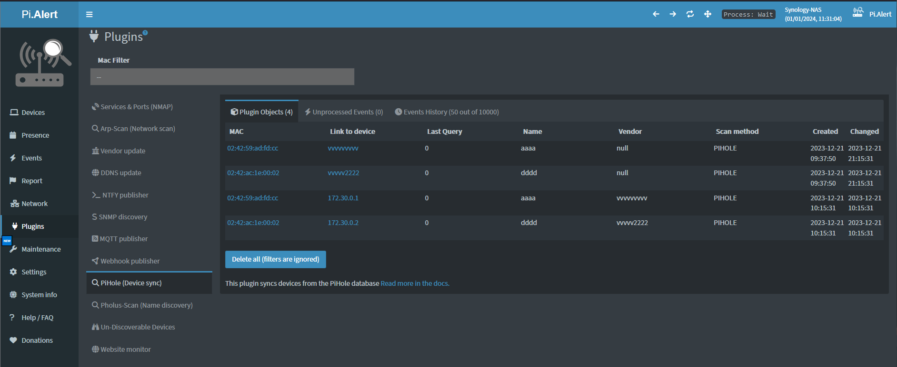

# Troubleshooting plugins

> [!TIP]
> Before troubleshooting, please ensure you have the right [Debugging and LOG_LEVEL set](./DEBUG_TIPS.md).

## High-level overview

If a Plugin supplies data to the main app it's done either vie a SQL query or via a script that updates the `last_result.log` file in the plugin log folder (`app/log/plugins/`).

For a more in-depth overview on how plugins work check the [Plugins development docs](https://github.com/jokob-sk/NetAlertX/blob/main/docs/PLUGINS.md).

### Prerequisites

- Make sure you read and followed the specific plugin setup instructions.
- Ensure you have [debug enabled (see More Logging)](./DEBUG_TIPS.md)

### Potential issues

- Bugs
- Unexpected input (e.g. special characters in names)
- Dependencies changed how data is output

#### Incorrect input data

Input data from the plugin might cause mapping issues in specific edge cases. Look for a corresponding section in the `app.log` file, for example notice the first line of the execution run of the `PIHOLE` plugin below:

```
17:31:05 [Scheduler] - Scheduler run for PIHOLE: YES
17:31:05 [Plugin utils] ---------------------------------------------
17:31:05 [Plugin utils] display_name: PiHole (Device sync)
17:31:05 [Plugins] CMD: SELECT n.hwaddr AS Object_PrimaryID, {s-quote}null{s-quote} AS Object_SecondaryID, datetime() AS DateTime, na.ip  AS Watched_Value1, n.lastQuery AS Watched_Value2, na.name AS Watched_Value3, n.macVendor AS Watched_Value4, {s-quote}null{s-quote} AS Extra, n.hwaddr AS ForeignKey FROM EXTERNAL_PIHOLE.Network AS n LEFT JOIN EXTERNAL_PIHOLE.Network_Addresses AS na ON na.network_id = n.id WHERE n.hwaddr NOT LIKE {s-quote}ip-%{s-quote} AND n.hwaddr is not {s-quote}00:00:00:00:00:00{s-quote}  AND na.ip is not null
17:31:05 [Plugins] setTyp: subnets
17:31:05 [Plugin utils] Flattening the below array
17:31:05 ['192.168.1.0/24 --interface=eth1']
17:31:05 [Plugin utils] isinstance(arr, list) : False | isinstance(arr, str) : True
17:31:05 [Plugins] Resolved value: 192.168.1.0/24 --interface=eth1
17:31:05 [Plugins] Convert to Base64: True
17:31:05 [Plugins] base64 value: b'MTkyLjE2OC4xLjAvMjQgLS1pbnRlcmZhY2U9ZXRoMQ=='
17:31:05 [Plugins] Timeout: 10
17:31:05 [Plugins] Executing: SELECT n.hwaddr AS Object_PrimaryID, 'null' AS Object_SecondaryID, datetime() AS DateTime, na.ip  AS Watched_Value1, n.lastQuery AS Watched_Value2, na.name AS Watched_Value3, n.macVendor AS Watched_Value4, 'null' AS Extra, n.hwaddr AS ForeignKey FROM EXTERNAL_PIHOLE.Network AS n LEFT JOIN EXTERNAL_PIHOLE.Network_Addresses AS na ON na.network_id = n.id WHERE n.hwaddr NOT LIKE 'ip-%' AND n.hwaddr is not '00:00:00:00:00:00'  AND na.ip is not null
🔻
17:31:05 [Plugins] SUCCESS, received 2 entries
17:31:05 [Plugins] sqlParam entries: [(0, 'PIHOLE', '01:01:01:01:01:01', 'null', 'null', '2023-12-25 06:31:05', '172.30.0.1', 0, 'aaaa', 'vvvvvvvvv', 'not-processed', 'null', 'null', '01:01:01:01:01:01'), (0, 'PIHOLE', '02:42:ac:1e:00:02', 'null', 'null', '2023-12-25 06:31:05', '172.30.0.2', 0, 'dddd', 'vvvvv2222', 'not-processed', 'null', 'null', '02:42:ac:1e:00:02')]
17:31:05 [Plugins] Processing        : PIHOLE
17:31:05 [Plugins] Existing objects from Plugins_Objects: 4
17:31:05 [Plugins] Logged events from the plugin run    : 2
17:31:05 [Plugins] pluginEvents      count: 2
17:31:05 [Plugins] pluginObjects     count: 4
17:31:05 [Plugins] events_to_insert  count: 0
17:31:05 [Plugins] history_to_insert count: 4
17:31:05 [Plugins] objects_to_insert count: 0
17:31:05 [Plugins] objects_to_update count: 4
17:31:05 [Plugin utils] In pluginEvents there are 2 events with the status "watched-not-changed"
17:31:05 [Plugin utils] In pluginObjects there are 2 events with the status "missing-in-last-scan"
17:31:05 [Plugin utils] In pluginObjects there are 2 events with the status "watched-not-changed"
17:31:05 [Plugins] Mapping objects to database table: CurrentScan
17:31:05 [Plugins] SQL query for mapping: INSERT into CurrentScan ( "cur_MAC", "cur_IP", "cur_LastQuery", "cur_Name", "cur_Vendor", "cur_ScanMethod") VALUES ( ?, ?, ?, ?, ?, ?)
17:31:05 [Plugins] SQL sqlParams for mapping: [('01:01:01:01:01:01', '172.30.0.1', 0, 'aaaa', 'vvvvvvvvv', 'PIHOLE'), ('02:42:ac:1e:00:02', '172.30.0.2', 0, 'dddd', 'vvvvv2222', 'PIHOLE')]
🔺
17:31:05 [API] Update API starting
17:31:06 [API] Updating table_plugins_history.json file in /api
```

> The debug output between the 🔻red arrows🔺 is important for debugging (arrows added only to highlight the section on this page, they are not available in the actual debug log)

In the above output notice the section logging how many events are produced by the plugin:

```
17:31:05 [Plugins] Existing objects from Plugins_Objects: 4
17:31:05 [Plugins] Logged events from the plugin run    : 2
17:31:05 [Plugins] pluginEvents      count: 2
17:31:05 [Plugins] pluginObjects     count: 4
17:31:05 [Plugins] events_to_insert  count: 0
17:31:05 [Plugins] history_to_insert count: 4
17:31:05 [Plugins] objects_to_insert count: 0
17:31:05 [Plugins] objects_to_update count: 4
```

These values, if formatted correctly, will also show up in the UI:




### Sharing application state

Sometimes specific log sections are needed to debug issues. The Devices and CurrentScan table data is sometimes needed to figure out what's wrong.

1. Please set `LOG_LEVEL` to `trace` (Disable it once you have the info as this produces big log files).
2. Wait for the issue to occur.
3. Search for `================ DEVICES table content  ================` in your logs.
4. Search for `================ CurrentScan table content  ================` in your logs.
5. Open a new issue and post (redacted) output into the issue description (or send to the netalertx@gmail.com email if sensitive data present).
6. Please set `LOG_LEVEL` to `debug` or lower.

