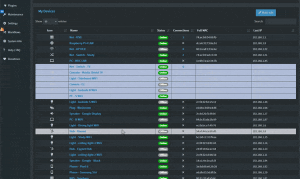
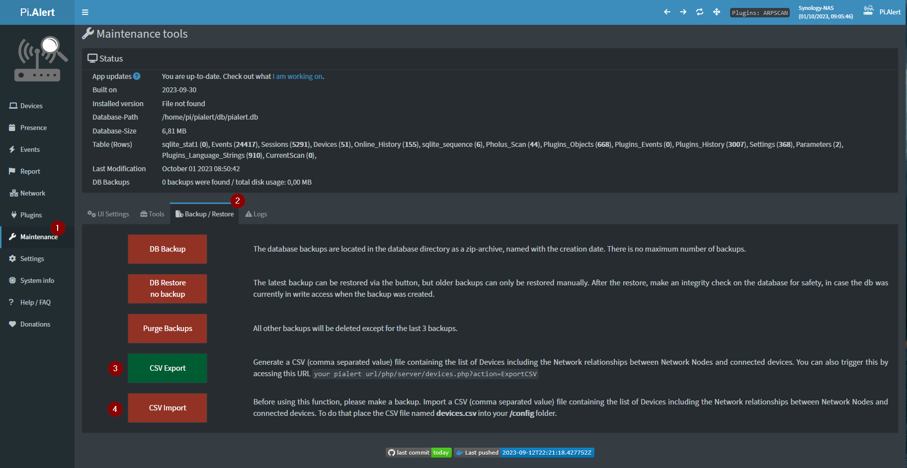
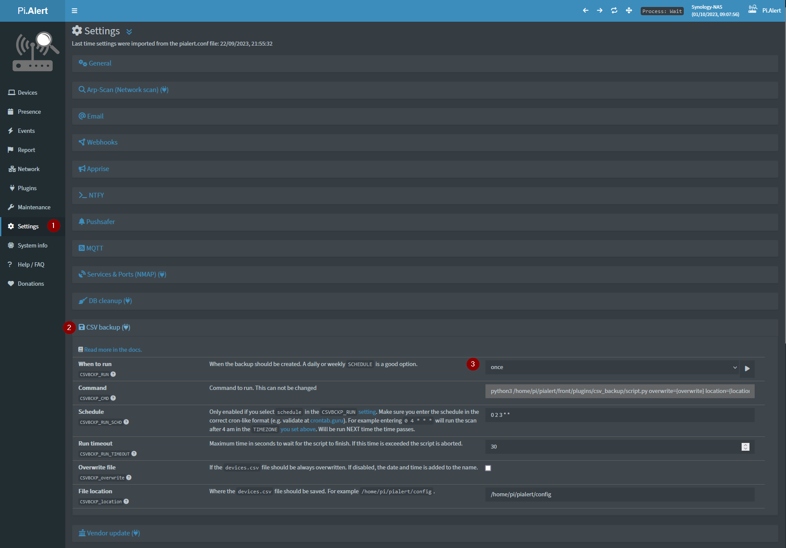

# Editing multiple devices at once

NetAlertX allows you to mass-edit devices via a CSV export and import feature, or directly in the UI.

## UI multi edit

> [!NOTE] 
> Make sure you have your backups saved and restorable before doing any mass edits. Check [Backup strategies](./BACKUPS.md). 

You can select devices in the _Devices_ view by selecting devices to edit and then clicking the _Multi-edit_ button or via the _Maintenance_ > _Multi-Edit_ section.

## CSV bulk edit

The database and device structure may change with new releases. When using the CSV import functionality, ensure the format matches what the application expects. To avoid issues, you can first export the devices and review the column formats before importing any custom data.

> [!NOTE] 
> As always, backup everything, just in case.

1. In _Maintenance_ > _Backup / Restore_ click the _CSV Export_ button.  
2. A `devices.csv` is generated in the `/config` folder
3. Edit the `devices.csv` file however you like. 

> [!NOTE] 
> The file containing a list of Devices including the Network relationships between Network Nodes and connected devices. You can also trigger this by acessing this URL: `<your netalertx url>/php/server/devices.php?action=ExportCSV` or via the `CSV Backup` plugin. (💡 You can schedule this)

### File encoding format

> [!NOTE] 
> Keep Linux line endings (suggested editors: Nano, Notepad++)

