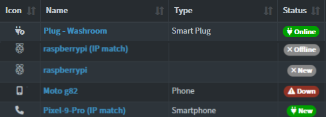

# Device Display Settings

This set of settings allows you to group Devices under different views. The Archived toggle allows you to exclude a Device from most listings and notifications. 

## Status Colors

1. 🔌 Online (Green) = A device that is no longer marked as a "New Device".
2. 🔌 New (Green) = A newly discovered device that is online and is still marked as a "New Device".
3. ✖ New (Grey) = Same as No.2 but device is now offline.
4. ✖ Offline (Grey) = A device that was not detected online in the last scan. 
5. ⚠ Down (Red) = A device that has "Alert Down" marked and has been offline for the time set in the Setting `NTFPRCS_alert_down_time`. 

See also [Notification guide](./NOTIFICATIONS.md).