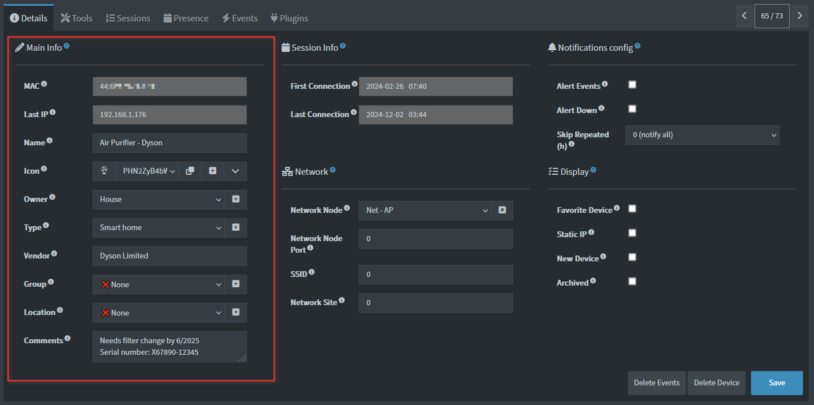
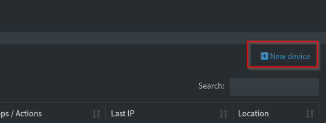

# Device Management

The Main Info section is where most of the device identifiable information is stored and edited. Some of the information is autodetected via various plugins. Initial values for most of the fields can be specified in the `NEWDEV` plugin.

> [!NOTE]
>
> You can multi-edit devices by selecting them in the main Devices view, from the Mainetence section, or via the CSV Export functionality under Maintenance. More info can be found in the [Devices Bulk-editing docs](./DEVICES_BULK_EDITING.md).

 

## Main Info

  - **MAC**: MAC addres of the device. Not editable, unless creating a new dummy device.
  - **Last IP**: IP addres of the device. Not editable, unless creating a new dummy device.
  - **Name**: Friendly device name. Autodetected via various 🆎 Name discovery [plugins](https://docs.netalertx.com/PLUGINS). The app attaches `(IP match)` if the name is discovered via an IP match and not MAC match which could mean the name could be incorrect as IPs might change.
  - **Icon**: Partially autodetected. Select an existing or [add a custom icon](./ICONS.md). You can also auto-apply the same icon on all devices of the same type.
  - **Owner**: Device owner (The list is self-populated with existing owners and you can add custom values).
  - **Type**: Select a device type from the dropdown list (`Smartphone`, `Tablet`,
      `Laptop`, `TV`, `router`, etc.) or add a new device type. If you want the device to act as a **Network device** (and be able to be a network node in the Network view), select a type under Network Devices or add a new Network Device type in Settings. More information can be found in the [Network Setup docs](./NETWORK_TREE.md).
  - **Vendor**: The manufacturing vendor. Automatically updated by NetAlertX when empty or unknown, can be edited.
  - **Group**: Select a group (`Always on`, `Personal`, `Friends`, etc.) or type
      your own Group name.
  - **Location**: Select the location, usually a room, where the device is located (`Kitchen`, `Attic`, `Living room`, etc.) or add a custom Location.
  - **Comments**: Add any comments for the device, such as a serial number, or maintenance information.

> [!NOTE]
>
> Please note the above usage of the fields are only suggestions. You can use most of these fields for other purposes, such as storing the network interface, company owning a device, or similar.

## Dummy devices

You can create dummy devices from the Devices listing screen.

The **MAC** field and the **Last IP** field will then become editable.

> [!NOTE]
>
> You can couple this with the `ICMP` plugin which can be used to monitor the status of these devices, if they are actual devices reachable with the `ping` command. If not, you can use a loopback IP address so they appear online, such as `0.0.0.0` or `127.0.0.1`.

## Copying data from an existing device.

To speed up device population you can also copy data from an existing device. This can be done from the **Tools** tab on the Device details.

