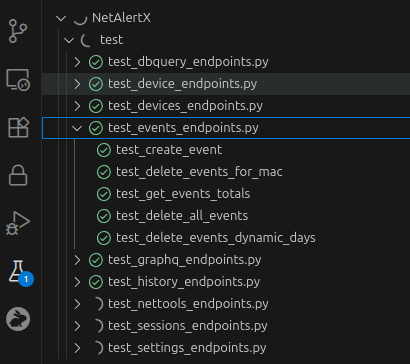

### Devcontainer for NetAlertX Guide

This devcontainer is designed to mirror the production container environment as closely as possible, while providing a rich set of tools for development.

#### How to Get Started

1.  **Prerequisites:**
    * A working **Docker installation** that can be managed by your user. This can be [Docker Desktop](https://www.docker.com/products/docker-desktop/) or Docker Engine installed via other methods (like the official [get-docker script](https://get.docker.com)).
    * [Visual Studio Code](https://code.visualstudio.com/) installed.
    * The [VS Code Dev Containers extension](https://marketplace.visualstudio.com/items?itemName=ms-vscode-remote.remote-containers) installed.

2.  **Launch the Devcontainer:**
    * Clone this repository.
    * Open the repository folder in VS Code.
    * A notification will pop up in the bottom-right corner asking to **"Reopen in Container"**. Click it.
    * VS Code will now build the Docker image and connect your editor to the container. Your terminal, debugger, and all tools will now be running inside this isolated environment.

#### Key Workflows & Features

Once you're inside the container, everything is set up for you.

**1. Services (Frontend & Backend)**

The container's startup script (`.devcontainer/scripts/setup.sh`) automatically starts the Nginx/PHP frontend and the Python backend. You can restart them at any time using the built-in tasks.

**2. Integrated Debugging (Just Press F5!)**

Debugging for both the Python backend and PHP frontend is pre-configured and ready to go.

* **Python Backend (debugpy):** The backend automatically starts with a debugger attached on port `5678`. Simply open a Python file (e.g., `server/__main__.py`), set a breakpoint, and press **F5** (or select "Python Backend Debug: Attach") to connect the debugger.
* **PHP Frontend (Xdebug):** Xdebug listens on port `9003`. In VS Code, start listening for Xdebug connections and use a browser extension (like "Xdebug helper") to start a debugging session for the web UI.

**3. Common Tasks (F1 -> Run Task)**

We've created several VS Code Tasks to simplify common operations. Access them by pressing `F1` and typing "Tasks: Run Task".

* `Generate Dockerfile`: **This is important.** The actual `.devcontainer/Dockerfile` is auto-generated. If you need to change the container environment, edit `.devcontainer/resources/devcontainer-Dockerfile` and then run this task.
* `Re-Run Startup Script`: Manually re-runs the `.devcontainer/scripts/setup.sh` script to re-link files and restart services.
* `Start Backend (Python)` / `Start Frontend (nginx and PHP-FPM)`: Manually restart the services if needed.

**4. Running Tests**

The environment includes `pytest`. You can run tests directly from the VS Code Test Explorer UI or by running `pytest -q` in the integrated terminal. The necessary `PYTHONPATH` is already configured so that tests can correctly import the server modules.

### How to Maintain This Devcontainer

The setup is designed to be easy to manage. Here are the core principles:

* **Don't Edit `Dockerfile` Directly:** The main `.devcontainer/Dockerfile` is a combination of the project's root `Dockerfile` and a special dev-only stage. To add new tools or dependencies, **edit `.devcontainer/resources/devcontainer-Dockerfile`** and then run the `Generate Dockerfile` task.
* **Build-Time vs. Run-Time Setup:**
    * For changes that can be baked into the image (like installing a new package with `apk add`), add them to the resource Dockerfile.
    * For changes that must happen when the container *starts* (like creating symlinks, setting permissions, or starting services), use `.devcontainer/scripts/setup.sh`.
* **Project Conventions:** The `.github/copilot-instructions.md` file is an excellent resource to help AI and humans understand the project's architecture, conventions, and how to use existing helper functions instead of hardcoding values.

This setup provides a powerful and consistent foundation for all current and future contributors to NetAlertX.