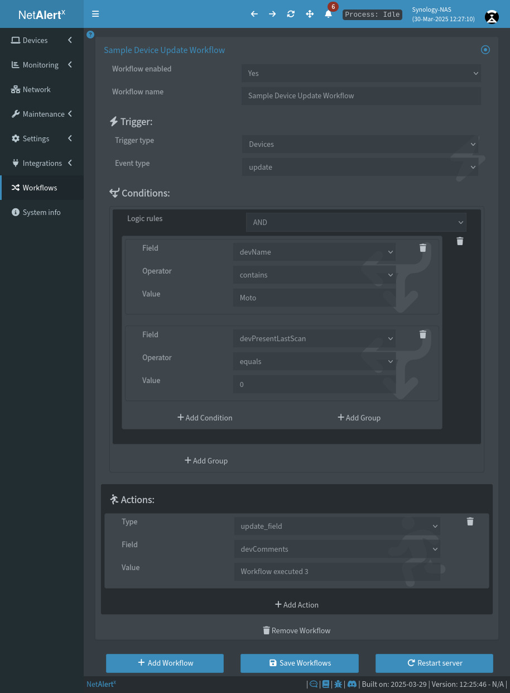

# ⚡ Quick Start Guide

Get **NetAlertX** up and running in a few simple steps.

---

### 1. Configure Scanner Plugin(s)

> [!TIP]
> Enable additional plugins under **Settings → `LOADED_PLUGINS`**.
> Make sure to **save** your changes and **reload the page** to activate them.
> 

**Initial configuration**: `ARPSCAN`, `INTRNT`

> [!NOTE]
> `ARPSCAN` and `INTRNT` scan the current network. You can complement them with other `🔍 dev scanner` plugins like `NMAPDEV`, or import devices using `📥 importer` plugins.
> See the [Subnet & VLAN Setup Guide](./SUBNETS.md) and [Remote Networks](./REMOTE_NETWORKS.md) for advanced configurations.

---

### 2. Choose a Publisher Plugin

**Initial configuration**: `SMTP`

> [!NOTE]
> Configure your SMTP settings or enable additional `▶️ publisher` plugins to send alerts.
> For more flexibility, try [📚 `_publisher_apprise`](/front/plugins/_publisher_apprise/), which supports over 80 notification services.

---

### 3. Set Up a Network Topology Diagram

**Initial configuration**: The app auto-selects a root node (MAC `internet`) and attempts to identify other network devices by vendor or name.

> [!NOTE]
> Visualize and manage your network using the [Network Guide](./NETWORK_TREE.md).
> Some plugins (e.g., `UNFIMP`) build the topology automatically, or you can use [Custom Workflows](./WORKFLOWS.md) to generate it based on your own rules.

---

### 4. Configure Notifications

**Initial configuration**: Notifies on `new_devices`, `down_devices`, and `events` as defined in `NTFPRCS_INCLUDED_SECTIONS`.

> [!NOTE]
> Notification settings support global, plugin-specific, and per-device rules.
> For fine-tuning, refer to the [Notification Guide](./NOTIFICATIONS.md).

---

### 5. Set Up Workflows

**Initial configuration**: N/A

> [!NOTE]
> Automate responses to device status changes, group management, topology updates, and more.
> See the [Workflows Guide](./WORKFLOWS.md) to simplify your network operations.

---

### 6. Backup Your Configuration

**Initial configuration**: The `CSVBCKP` plugin creates a daily backup to `/config/devices.csv`.

> [!NOTE]
> For a complete backup strategy, follow the [Backup Guide](./BACKUPS.md).

---

### 7. (Optional) Create Custom Plugins

**Initial configuration**: N/A

> [!NOTE]
> Build your own scanner, importer, or publisher plugin.
> See the [Plugin Development Guide](./PLUGINS_DEV.md) and included video tutorials.

---

## 📁 Recommended Guides

* 📘 [PiHole Setup Guide](./PIHOLE_GUIDE.md)
* 📘 [CSV Import Method](./DEVICES_BULK_EDITING.md)
* 📘 [Community Guides (Chinese, Korean, German, French)](./COMMUNITY_GUIDES.md)

---

## 🛠️ Troubleshooting & Help

Before opening a new issue:

* 📘 [Common Issues](./COMMON_ISSUES.md)
* 🧰 [Debugging Tips](./DEBUG_TIPS.md)
* ✅ [Browse resolved GitHub issues](https://github.com/jokob-sk/NetAlertX/issues?q=is%3Aissue+is%3Aclosed)

---

Let me know if you want a condensed README version, separate pages for each section, or UI copy based on this!
