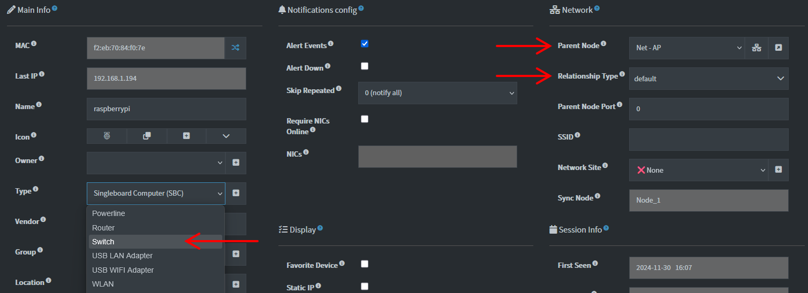
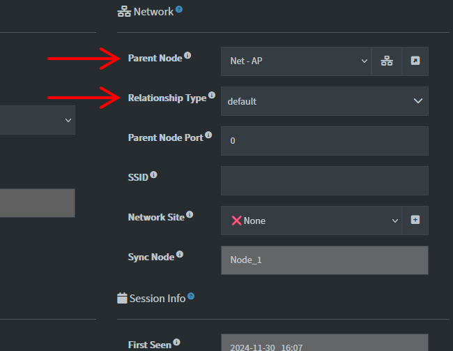
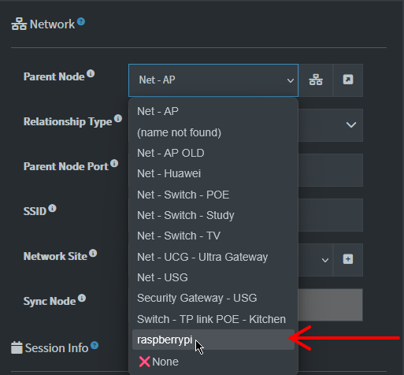
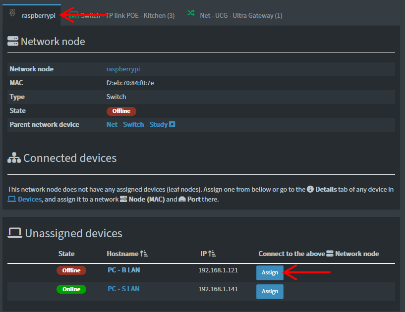
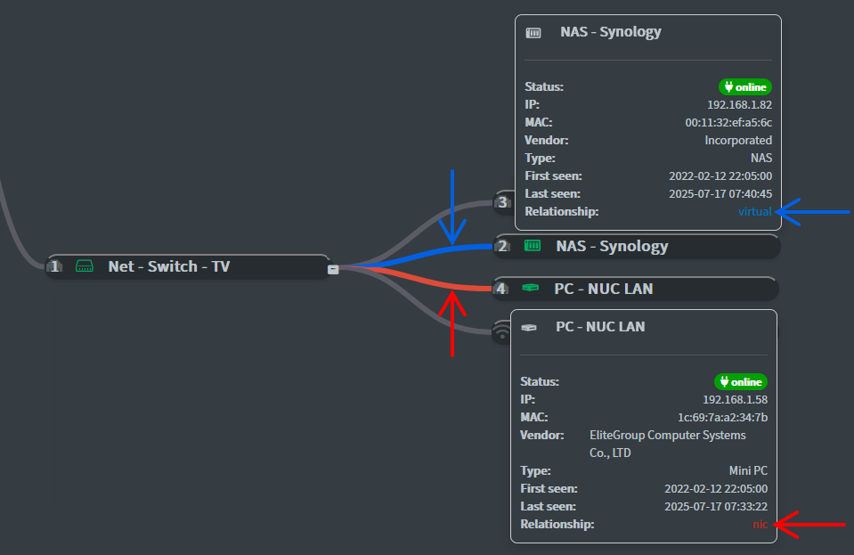

## How to Set Up Your Network Page

The **Network** page lets you map how devices connect — visually and logically.  
It’s especially useful for planning infrastructure, assigning parent-child relationships, and spotting gaps.

To get started, you’ll need to define at least one root node and mark certain devices as network nodes (like Switches or Routers).

---

Start by creating a root device with the MAC address `Internet`, if the application didn’t create one already.  
This special MAC address (`Internet`) is required for the root network node — no other value is currently supported.  
Set its **Type** to a valid network type — such as `Router` or `Gateway`.

> [!TIP]  
> If you don’t have one, use the [Create new device](./DEVICE_MANAGEMENT.md#dummy-devices) button on the **Devices** page to add a root device.

---

## ⚡ Quick Setup

1. Open the device you want to use as a network node (e.g. a Switch).
2. Set its **Type** to one of the following:  
   `AP`, `Firewall`, `Gateway`, `PLC`, `Powerline`, `Router`, `Switch`, `USB LAN Adapter`, `USB WIFI Adapter`, `WLAN`  
   *(Or add custom types under **Settings → General → `NETWORK_DEVICE_TYPES`**.)*
3. Save the device.
4. Go to the **Network** page — supported device types will appear as tabs.
5. Use the **Assign** button to connect unassigned devices to a network node.
6. If the **Port** is `0` or empty, a Wi-Fi icon is shown. Otherwise, an Ethernet icon appears.

> [!NOTE]  
> Use [bulk editing](./DEVICES_BULK_EDITING.md) with _CSV Export_ to fix `Internet` root assignments or update many devices at once.

---

## Example: Setting up a `raspberrypi` as a Switch

Let’s walk through setting up a device named `raspberrypi` to act as a network Switch that other devices connect through.

---

### 1. Set Device Type and Parent

- Go to the **Devices** page  
- Open the device detail view for `raspberrypi`
- In the **Type** dropdown, select `Switch`

- Optionally assign a **Parent Node** (where this device connects to) and the **Relationship type** of the connection.  
  The `nic` relationship type can affect parent notifications — see the setting description and [Notifications documentation](./NOTIFICATIONS.md) for more.

  

> [!NOTE]  
> Only certain device types can act as network nodes:  
> `AP`, `Firewall`, `Gateway`, `Hypervisor`, `PLC`, `Powerline`, `Router`, `Switch`, `USB LAN Adapter`, `USB WIFI Adapter`, `WLAN`  
> You can add custom types via the `NETWORK_DEVICE_TYPES` setting.

- Click **Save**

---

### 2. Confirm The Device Appears as a Network Node

You can confirm that `raspberrypi` now acts as a network device in two places:

- Navigate to a different device and verify that `raspberrypi` now appears as an option for a **Parent Node**:

- Go to the **Network** page — you'll now see a `raspberrypi` tab, meaning it's recognized as a network node (Switch):

- You can now assign other devices to it.

---

### 3. Assign Connected Devices

- Use the **Assign** button to link other devices (e.g. PCs) to `raspberrypi`.
- After assigning, connected devices will appear beneath the `raspberrypi` switch node.  

- Relationship lines may vary in color based on the selected Relationship type. These are editable on the device details page where you can also assign a parent node.

> Hovering over devices in the tree reveals connection details and tooltips for quick inspection.

> [!NOTE]
> Selecting certain relationship types hides the device in the default device views.  
> You can change this behavior by adjusting the `UI_hide_rel_types` setting, which by default is set to `["nic","virtual"]`.  
> This means devices with `devParentRelType` set to `nic` or `virtual` will not be shown.  
> All devices, regardless of relationship type, are always accessible in the **All devices** view.

---

## ✅ Summary

To configure devices on the **Network** page:

- Ensure a device with MAC `Internet` is set up as the root
- Assign valid **Type** values to switches, routers, and other supported nodes that represent network devices
- Use the **Assign** button to connect devices logically to their parent node

Need to reset or undo changes? [Use backups](./BACKUPS.md) or [bulk editing](./DEVICES_BULK_EDITING.md) to manage devices at scale. You can also automate device assignment with [Workflows](./WORKFLOWS.md).
