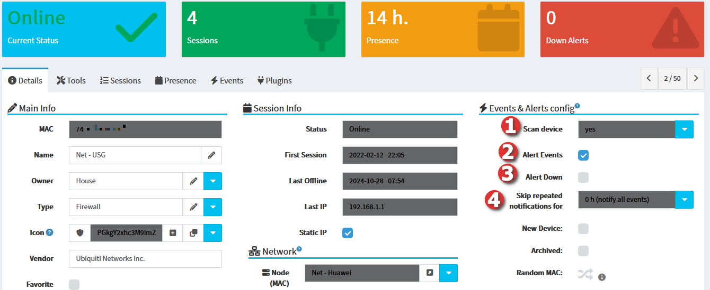
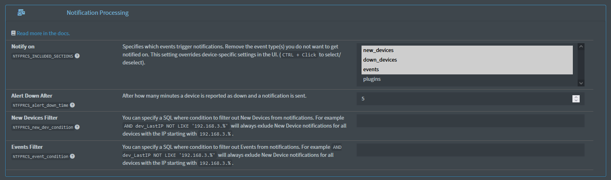

# Notifications 📧

There are 4 ways how to influence notifications:

1. On the device itself
2. On the settings of the plugin
3. Globally
4. Ignoring devices

> [!NOTE]
> It's recommended to use the same schedule interval for all plugins responsible for scanning devices, otherwise false positives might be reported if different devices are discovered by different plugins. Check the **Settings** > **Enabled settings** section for a warning:
> 

## Device settings 💻

The following device properties influence notifications. You can:

1. **Alert Events** - Enables alerts of connections, disconnections, IP changes (down and down reconnected notifications are still sent even if this is disabled).
2. **Alert Down** - Alerts when a device goes down. This setting overrides a disabled **Alert Events** setting, so you will get a notification of a device going down even if you don't have **Alert Events** ticked. Disabling this will disable down and down reconnected notifications on the device.
3. **Skip repeated notifications**, if for example you know there is a temporary issue and want to pause the same notification for this device for a given time.
4. **Require NICs Online** - Indicates whether this device should be considered online only if all associated NICs (devices with the `nic` relationship type) are online. If disabled, the device is considered online if any NIC is online. If a NIC is online it sets the parent (this) device's status to online irrespectivelly of the detected device's status. The Relationship type is set on the childern device.

> [!NOTE]
> Please read through the [NTFPRCS plugin](https://github.com/jokob-sk/NetAlertX/blob/main/front/plugins/notification_processing/README.md) documentation to understand how device and global settings influence the notification processing. 

## Plugin settings 🔌

On almost all plugins there are 2 core settings, `<plugin>_WATCH` and `<plugin>_REPORT_ON`. 

1. `<plugin>_WATCH` specifies the columns which the app should watch. If watched columns change the device state is considered changed. This changed status is then used to decide to send out notifications based on the `<plugin>_REPORT_ON` setting. 
2. `<plugin>_REPORT_ON` let's you specify on which events the app should notify you. This is related to the `<plugin>_WATCH` setting. So if you select `watched-changed` and in `<plugin>_WATCH` you only select `Watched_Value1`, then a notification is triggered if `Watched_Value1` is changed from the previous value, but no notification is send if `Watched_Value2` changes. 

Click the **Read more in the docs.** Link at the top of each plugin to get more details on how the given plugin works. 

## Global settings ⚙

In Notification Processing settings, you can specify blanket rules. These allow you to specify exceptions to the Plugin and Device settings and will override those.

1. Notify on (`NTFPRCS_INCLUDED_SECTIONS`) allows you to specify which events trigger notifications. Usual setups will have `new_devices`, `down_devices`, and possibly `down_reconnected` set. Including `plugin` (dependenton the Plugin `<plugin>_WATCH` and `<plugin>_REPORT_ON` settings) and `events` (dependent on the on-device **Alert Events** setting) might be too noisy for most setups. More info in the [NTFPRCS plugin](https://github.com/jokob-sk/NetAlertX/blob/main/front/plugins/notification_processing/README.md) on what events these selections include. 
2. Alert down after (`NTFPRCS_alert_down_time`) is useful if you want to wait for some time before the system sends out a down notification for a device. This is related to the on-device **Alert down** setting and only devices with this checked will trigger a down notification.
3. A filter to allow you to set device-specific exceptions to New devices being added to the app.
4. A filter to allow you to set device-specific exceptions to generated Events.

## Ignoring devices 💻

You can completely ignore detected devices globally. This could be because your instance detects docker containers, you want to ignore devices from a specific manufacturer via MAC rules or you want to ignore devices on a specific IP range. 

1. Ignored MACs (`NEWDEV_ignored_MACs`) - List of MACs to ignore.
2. Ignored IPs (`NEWDEV_ignored_IPs`) - List of IPs to ignore. 

## Ignoring notifications 🔕

You can filter out unwanted notifications globally. This could be because of a misbehaving device (GoogleNest/GoogleHub (See also [ARPSAN docs and the `--exclude-broadcast` flag](https://github.com/jokob-sk/NetAlertX/tree/main/front/plugins/arp_scan#ip-flipping-on-google-nest-devices))) which flips between IP addresses, or because you want to ignore new device notifications of a certian pattern.

1. Events Filter (`NTFPRCS_event_condition`) -  filter out Events from notifications.
2. New Devices Filter (`NTFPRCS_new_dev_condition`) -  filter out New Devices from notifications, but log and keep a new device in the system.