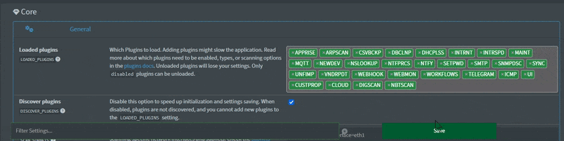

# 🔌 Plugins

NetAlertX supports additional plugins to extend its functionality, each with its own settings and options. Plugins can be loaded via the General -> `LOADED_PLUGINS` setting. For custom plugin development, refer to the [Plugin development guide](./PLUGINS_DEV.md).   

>[!NOTE]
> Please check this [Plugins debugging guide](./DEBUG_PLUGINS.md) and the corresponding Plugin documentation in the below table if you are facing issues.  

## ⚡ Quick start

> [!TIP]
> You can load additional Plugins via the General -> `LOADED_PLUGINS` setting. You need to save the settings for the new plugins to load (cache/page reload may be necessary). 
> 

1. Pick your `🔍 dev scanner` plugin (e.g. `ARPSCAN` or `NMAPDEV`), or import devices into the application with an `📥 importer` plugin. (See **Enabling plugins** below)
2. Pick a `▶️ publisher` plugin, if you want to send notifications. If you don't see a publisher you'd like to use, look at the  [📚_publisher_apprise](/front/plugins/_publisher_apprise/) plugin which is a proxy for over 80 notification services. 
3. Setup your [Network topology diagram](./NETWORK_TREE.md)
4. Fine-tune [Notifications](./NOTIFICATIONS.md)
5. Setup [Workflows](./WORKFLOWS.md)
6. [Backup your setup](./BACKUPS.md)
7. Contribute and [Create custom plugins](./PLUGINS_DEV.md)

## Plugin types

| Plugin type    | Icon | Description                                                      | When to run                         | Required | Data source [?](./PLUGINS_DEV.md) |
| -------------- | ---- | ---------------------------------------------------------------- | ----------------------------------- | -------- | ------------------------------------- |
| publisher      | ▶️    | Sending notifications to services.                               | `on_notification`                   | ✖        | Script                                |
| dev scanner    | 🔍    | Create devices in the app, manages online/offline device status. | `schedule`                          | ✖        | Script / SQLite DB                    |
| name discovery | 🆎    | Discovers names of devices via various protocols.                | `before_name_updates`, `schedule`   | ✖        | Script                                |
| importer       | 📥    | Importing devices from another service.                          | `schedule`                          | ✖        | Script / SQLite DB                    |
| system         | ⚙    | Providing core system functionality.                             | `schedule` / always on              | ✖/✔      | Script / Template                     |
| other          | ♻    | Other plugins                                                    | misc                                | ✖        | Script / Template                     |

## Features

| Icon | Description                                                  |
| ---- | ------------------------------------------------------------ |
| 🖧    | Auto-imports the network topology diagram                    |
| 🔄    | Has the option to sync some data back into the plugin source |

## Available Plugins
 
Device-detecting plugins insert values into the `CurrentScan` database table.  The plugins that are not required are safe to ignore, however, it makes sense to have at least some device-detecting plugins enabled, such as `ARPSCAN` or `NMAPDEV`. 

| ID              | Plugin docs                                                                                                      | Type     | Description                               | Features | Required |
| --------------- | ------------------------------------------------------------------------------------------------------------------ | -------- | ----------------------------------------- | -------- | -------- |
| `APPRISE`       | [_publisher_apprise](https://github.com/jokob-sk/NetAlertX/tree/main/front/plugins/_publisher_apprise/)          | ▶️       | Apprise notification proxy                |          |          |
| `ARPSCAN`       | [arp_scan](https://github.com/jokob-sk/NetAlertX/tree/main/front/plugins/arp_scan/)                               | 🔍       | ARP-scan on current network               |          |          |
| `AVAHISCAN`     | [avahi_scan](https://github.com/jokob-sk/NetAlertX/tree/main/front/plugins/avahi_scan/)                           | 🆎       | Avahi (mDNS-based) name resolution        |          |          |
| `ASUSWRT`       | [asuswrt_import](https://github.com/jokob-sk/NetAlertX/tree/main/front/plugins/asuswrt_import/)                   | 🔍       | Import connected devices from AsusWRT     |          |          |
| `CSVBCKP`       | [csv_backup](https://github.com/jokob-sk/NetAlertX/tree/main/front/plugins/csv_backup/)                           | ⚙        | CSV devices backup                        |          |          |
| `CUSTPROP`      | [custom_props](https://github.com/jokob-sk/NetAlertX/tree/main/front/plugins/custom_props/)                       | ⚙        | Managing custom device properties values  |          | Yes      |
| `DBCLNP`        | [db_cleanup](https://github.com/jokob-sk/NetAlertX/tree/main/front/plugins/db_cleanup/)                           | ⚙        | Database cleanup                          |          | Yes\*    |
| `DDNS`          | [ddns_update](https://github.com/jokob-sk/NetAlertX/tree/main/front/plugins/ddns_update/)                         | ⚙        | DDNS update                               |          |          |
| `DHCPLSS`       | [dhcp_leases](https://github.com/jokob-sk/NetAlertX/tree/main/front/plugins/dhcp_leases/)                         | 🔍/📥/🆎 | Import devices from DHCP leases           |          |          |
| `DHCPSRVS`      | [dhcp_servers](https://github.com/jokob-sk/NetAlertX/tree/main/front/plugins/dhcp_servers/)                       | ♻        | DHCP servers                              |          |          |
| `DIGSCAN`       | [dig_scan](https://github.com/jokob-sk/NetAlertX/tree/main/front/plugins/dig_scan/)                               | 🆎       | Dig (DNS) Name resolution                 |          |          |
| `FREEBOX`       | [freebox](https://github.com/jokob-sk/NetAlertX/tree/main/front/plugins/freebox/)                                  | 🔍/♻/🆎  | Pull data and names from Freebox/Iliadbox |          |          |
| `ICMP`          | [icmp_scan](https://github.com/jokob-sk/NetAlertX/tree/main/front/plugins/icmp_scan/)                             | ♻        | ICMP (ping) status checker                |          |          |
| `INTRNT`        | [internet_ip](https://github.com/jokob-sk/NetAlertX/tree/main/front/plugins/internet_ip/)                         | 🔍       | Internet IP scanner                       |          |          |
| `INTRSPD`       | [internet_speedtest](https://github.com/jokob-sk/NetAlertX/tree/main/front/plugins/internet_speedtest/)           | ♻        | Internet speed test                       |          |          |
| `IPNEIGH`       | [ipneigh](https://github.com/jokob-sk/NetAlertX/tree/main/front/plugins/ipneigh/)                                  | 🔍       | Scan ARP (IPv4) and NDP (IPv6) tables     |          |          |
| `LUCIRPC`       | [luci_import](https://github.com/jokob-sk/NetAlertX/tree/main/front/plugins/luci_import/)                         | 🔍       | Import connected devices from OpenWRT     |          |          |
| `MAINT`         | [maintenance](https://github.com/jokob-sk/NetAlertX/tree/main/front/plugins/maintenance/)                          | ⚙        | Maintenance of logs, etc.                 |          |          |
| `MQTT`          | [_publisher_mqtt](https://github.com/jokob-sk/NetAlertX/tree/main/front/plugins/_publisher_mqtt/)                | ▶️       | MQTT for synching to Home Assistant       |          |          |
| `MTSCAN`        | [mikrotik_scan](https://github.com/jokob-sk/NetAlertX/tree/main/front/plugins/mikrotik_scan/)                    | 🔍       | Mikrotik device import & sync              |          |          |
| `NBTSCAN`       | [nbtscan_scan](https://github.com/jokob-sk/NetAlertX/tree/main/front/plugins/nbtscan_scan/)                       | 🆎       | Nbtscan (NetBIOS-based) name resolution   |          |          |
| `NEWDEV`        | [newdev_template](https://github.com/jokob-sk/NetAlertX/tree/main/front/plugins/newdev_template/)                 | ⚙        | New device template                       |          | Yes      |
| `NMAP`          | [nmap_scan](https://github.com/jokob-sk/NetAlertX/tree/main/front/plugins/nmap_scan/)                             | ♻        | Nmap port scanning & discovery            |          |          |
| `NMAPDEV`       | [nmap_dev_scan](https://github.com/jokob-sk/NetAlertX/tree/main/front/plugins/nmap_dev_scan/)                    | 🔍       | Nmap dev scan on current network          |          |          |
| `NSLOOKUP`      | [nslookup_scan](https://github.com/jokob-sk/NetAlertX/tree/main/front/plugins/nslookup_scan/)                     | 🆎       | NSLookup (DNS-based) name resolution      |          |          |
| `NTFPRCS`       | [notification_processing](https://github.com/jokob-sk/NetAlertX/tree/main/front/plugins/notification_processing/) | ⚙        | Notification processing                   |          | Yes      |
| `NTFY`          | [_publisher_ntfy](https://github.com/jokob-sk/NetAlertX/tree/main/front/plugins/_publisher_ntfy/)                | ▶️       | NTFY notifications                        |          |          |
| `OMDSDN`        | [omada_sdn_imp](https://github.com/jokob-sk/NetAlertX/tree/main/front/plugins/omada_sdn_imp/)                    | 📥/🆎 ❌  | UNMAINTAINED use `OMDSDNOPENAPI`          | 🖧 🔄    |          |
| `OMDSDNOPENAPI` | [omada_sdn_openapi](https://github.com/jokob-sk/NetAlertX/tree/main/front/plugins/omada_sdn_openapi/)            | 📥/🆎    | OMADA TP-Link import via OpenAPI          | 🖧       |          |
| `PIHOLE`        | [pihole_scan](https://github.com/jokob-sk/NetAlertX/tree/main/front/plugins/pihole_scan/)                         | 🔍/🆎/📥 | Pi-hole device import & sync              |          |          |
| `PUSHSAFER`     | [_publisher_pushsafer](https://github.com/jokob-sk/NetAlertX/tree/main/front/plugins/_publisher_pushsafer/)      | ▶️       | Pushsafer notifications                   |          |          |
| `PUSHOVER`      | [_publisher_pushover](https://github.com/jokob-sk/NetAlertX/tree/main/front/plugins/_publisher_pushover/)        | ▶️       | Pushover notifications                    |          |          |
| `SETPWD`        | [set_password](https://github.com/jokob-sk/NetAlertX/tree/main/front/plugins/set_password/)                       | ⚙        | Set password                              |          | Yes      |
| `SMTP`          | [_publisher_email](https://github.com/jokob-sk/NetAlertX/tree/main/front/plugins/_publisher_email/)              | ▶️       | Email notifications                       |          |          |
| `SNMPDSC`       | [snmp_discovery](https://github.com/jokob-sk/NetAlertX/tree/main/front/plugins/snmp_discovery/)                   | 🔍/📥    | SNMP device import & sync                 |          |          |
| `SYNC`          | [sync](https://github.com/jokob-sk/NetAlertX/tree/main/front/plugins/sync/)                                      | 🔍/⚙/📥  | Sync & import from NetAlertX instances    | 🖧 🔄    | Yes      |
| `TELEGRAM`      | [_publisher_telegram](https://github.com/jokob-sk/NetAlertX/tree/main/front/plugins/_publisher_telegram/)        | ▶️       | Telegram notifications                    |          |          |
| `UI`            | [ui_settings](https://github.com/jokob-sk/NetAlertX/tree/main/front/plugins/ui_settings/)                         | ♻        | UI specific settings                      |          | Yes      |
| `UNFIMP`        | [unifi_import](https://github.com/jokob-sk/NetAlertX/tree/main/front/plugins/unifi_import/)                       | 🔍/📥/🆎 | UniFi device import & sync                | 🖧       |          |
| `UNIFIAPI`      | [unifi_api_import](https://github.com/jokob-sk/NetAlertX/tree/main/front/plugins/unifi_api_import/)               | 🔍/📥/🆎 | UniFi device import (SM API, multi-site) |           |         |
| `VNDRPDT`       | [vendor_update](https://github.com/jokob-sk/NetAlertX/tree/main/front/plugins/vendor_update/)                     | ⚙        | Vendor database update                    |          |          |
| `WEBHOOK`       | [_publisher_webhook](https://github.com/jokob-sk/NetAlertX/tree/main/front/plugins/_publisher_webhook/)          | ▶️       | Webhook notifications                     |          |          |
| `WEBMON`        | [website_monitor](https://github.com/jokob-sk/NetAlertX/tree/main/front/plugins/website_monitor/)                 | ♻        | Website down monitoring                   |          |          |
| `WOL`           | [wake_on_lan](https://github.com/jokob-sk/NetAlertX/tree/main/front/plugins/wake_on_lan/)                        | ♻        | Automatic wake-on-lan                     |          |          |

> \* The database cleanup plugin (`DBCLNP`) is not _required_ but the app will become unusable after a while if not executed.
> ❌ marked for removal/unmaintained - looking for help
> ⌚It's recommended to use the same schedule interval for all plugins responsible for discovering new devices.

## Enabling plugins

Plugins can be enabled via Settings, and can be disabled as needed. 

1. Research which plugin you'd like to use, enable `DISCOVER_PLUGINS` and load the required plugins in Settings via the `LOADED_PLUGINS` setting.
1. Save the changes and review the Settings of the newly loaded plugins. 
1. Change the `<prefix>_RUN` Setting to the recommended or custom value as per the documentation of the given setting  
    - If using `schedule` on a `🔍 dev scanner` plugin, make sure the schedules are the same across all `🔍 dev scanner` plugins

### Disabling, Unloading and Ignoring plugins

1. Change the `<prefix>_RUN` Setting to `disabled` if you want to disable the plugin, but keep the settings
1. If you want to speed up the application, you can unload the plugin by unselecting it in the `LOADED_PLUGINS` setting.
    - Careful, once you save the Settings Unloaded plugin settings will be lost (old `app.conf` files are kept in the `/config` folder) 
1. You can completely ignore plugins by placing a `ignore_plugin` file into the plugin directory. Ignored plugins won't show up in the `LOADED_PLUGINS` setting.

## 🆕 Developing new custom plugins

If you want to develop a custom plugin, please read this [Plugin development guide](./PLUGINS_DEV.md).