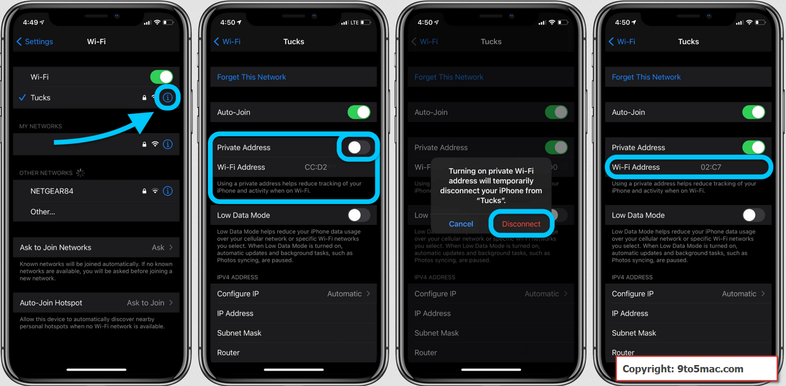

# Privacy & Random MAC's
<!--- --------------------------------------------------------------------- --->

Some operating systems incorporate randomize MAC addresses to improve privacy.

This functionality allows you to **hide the real MAC** of the device and **assign a random MAC** when we connect to WIFI networks.

This behavior is especially useful when connecting to WIFI's that we do not know, but it **is totally useless when connecting to our own WIFI's** or known networks.

**I recommend disabling this on-device functionality when connecting our devices to our own WIFI's**, this way, NetAlertX will be able to identify the device, and it will not identify it as a new device every so often (every time iOS or Android randomizes the MAC).

**Random MACs** are recognized by the characters "2", "6", "A", or "E" as the 2nd character in the Mac address. You can disable specific prefixes to be detected as random MAC addresses by specifying the `UI_NOT_RANDOM_MAC` setting.

## Windows

  - [How to Disable MAC Randomization on Windows](https://www.androidphonesoft.com/blog/how-to-turn-off-random-mac-address-windows-10/)

## IOS

  - [Use private Wi-Fi addresses in iOS 14](https://support.apple.com/en-us/HT211227)

## Android

  - [How to Disable MAC Randomization in Android 10](https://support.boingo.com/s/article/How-to-Disable-MAC-Randomization-in-Android-10-Android-Q)
  - [How do I disable random Wi-Fi MAC address on Android 10](https://support.plume.com/hc/en-gb/articles/360052070714-How-do-I-disable-random-Wi-Fi-MAC-address-on-Android-10-)
  
