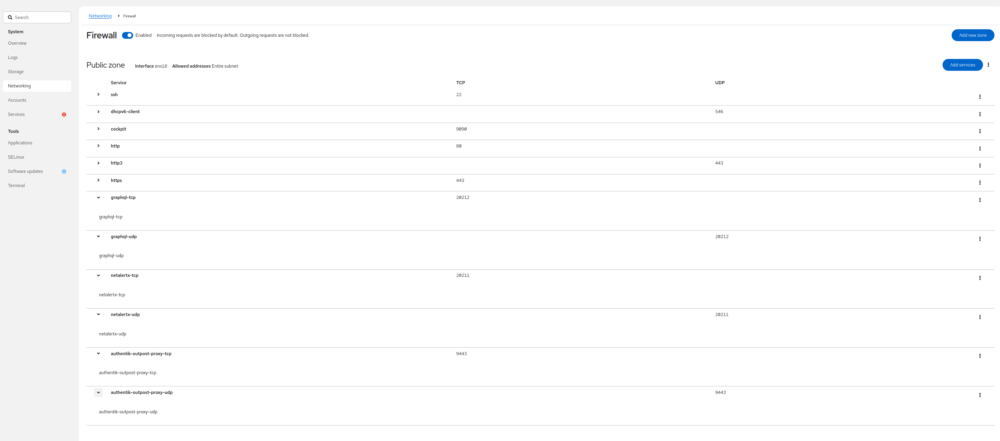
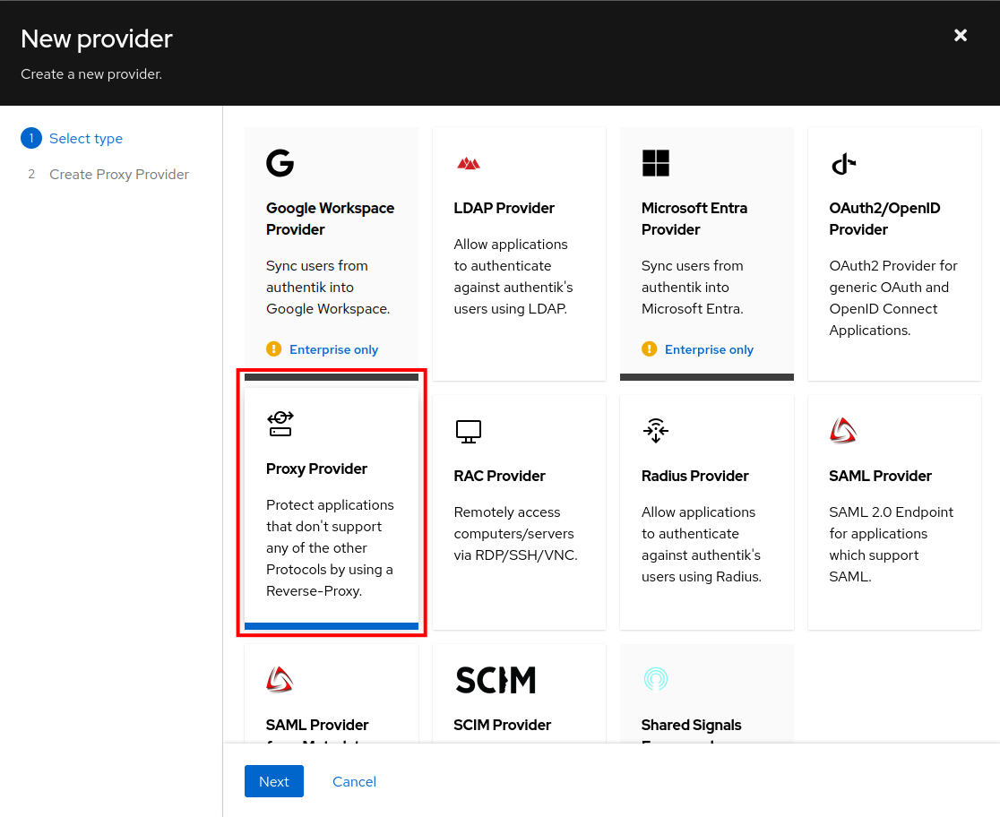

# Reverse Proxy Configuration

> [!TIP]
> You will need to specify the `BACKEND_API_URL` setting if you are running reverse proxies. This is the URL that points to the backend server url (including your `GRAPHQL_PORT`)
>
> 
> 

## NGINX HTTP Configuration (Direct Path)

> Submitted by amazing [cvc90](https://github.com/cvc90) 🙏

> [!NOTE]
> There are various NGINX config files for NetAlertX, some for the bare-metal install, currently Debian 12 and Ubuntu 24 (`netalertx.conf`), and one for the docker container (`netalertx.template.conf`).
>
> The first one you can find in the respective bare metal installer folder `/app/install/\<system\>/netalertx.conf`.
> The docker one can be found in the [install](https://github.com/jokob-sk/NetAlertX/tree/main/install) folder. Map, or use, the one appropriate for your setup.

<br/>

1. On your NGINX server, create a new file called /etc/nginx/sites-available/netalertx

2. In this file, paste the following code:

```
   server {
     listen 80;
     server_name netalertx;
     proxy_preserve_host on;
     proxy_pass http://localhost:20211/;
     proxy_pass_reverse http://localhost:20211/;
    }
```

3. Activate the new website by running the following command:

   `nginx -s reload` or `systemctl restart nginx`

4. Check your config with `nginx -t`. If there are any issues, it will tell you.

5. Once NGINX restarts, you should be able to access the proxy website at http://netalertx/

<br/>

## NGINX HTTP Configuration (Sub Path)

1. On your NGINX server, create a new file called /etc/nginx/sites-available/netalertx

2. In this file, paste the following code:

```
   server {
     listen 80;
     server_name netalertx;
     proxy_preserve_host on;
     location ^~ /netalertx/ {
          proxy_pass http://localhost:20211/;
          proxy_pass_reverse http://localhost:20211/;
          proxy_redirect ~^/(.*)$ /netalertx/$1;
          rewrite ^/netalertx/?(.*)$ /$1 break;
     }
    }
```

3. Check your config with `nginx -t`. If there are any issues, it will tell you.

4. Activate the new website by running the following command:

   `nginx -s reload` or `systemctl restart nginx`

5. Once NGINX restarts, you should be able to access the proxy website at http://netalertx/netalertx/

<br/>

## NGINX HTTP Configuration (Sub Path) with module ngx_http_sub_module

1. On your NGINX server, create a new file called /etc/nginx/sites-available/netalertx

2. In this file, paste the following code:

```
   server {
     listen 80;
     server_name netalertx;
     proxy_preserve_host on;
     location ^~ /netalertx/ {
          proxy_pass http://localhost:20211/;
          proxy_pass_reverse http://localhost:20211/;
          proxy_redirect ~^/(.*)$ /netalertx/$1;
          rewrite ^/netalertx/?(.*)$ /$1 break;
	  sub_filter_once off;
	  sub_filter_types *;
	  sub_filter 'href="/' 'href="/netalertx/';
	  sub_filter '(?>$host)/css' '/netalertx/css';
	  sub_filter '(?>$host)/js'  '/netalertx/js';
	  sub_filter '/img' '/netalertx/img';
	  sub_filter '/lib' '/netalertx/lib';
	  sub_filter '/php' '/netalertx/php';
     }
    }
```

3. Check your config with `nginx -t`. If there are any issues, it will tell you.

4. Activate the new website by running the following command:

   `nginx -s reload` or `systemctl restart nginx`

5. Once NGINX restarts, you should be able to access the proxy website at http://netalertx/netalertx/

<br/>

**NGINX HTTPS Configuration (Direct Path)**

1. On your NGINX server, create a new file called /etc/nginx/sites-available/netalertx

2. In this file, paste the following code:

```
   server {
     listen 443;
     server_name netalertx;
     SSLEngine On;
     SSLCertificateFile /etc/ssl/certs/netalertx.pem;
     SSLCertificateKeyFile /etc/ssl/private/netalertx.key;
     proxy_preserve_host on;
     proxy_pass http://localhost:20211/;
     proxy_pass_reverse http://localhost:20211/;
    }
```

3. Check your config with `nginx -t`. If there are any issues, it will tell you.

4. Activate the new website by running the following command:

   `nginx -s reload` or `systemctl restart nginx`

5. Once NGINX restarts, you should be able to access the proxy website at https://netalertx/

<br/>

**NGINX HTTPS Configuration (Sub Path)**

1. On your NGINX server, create a new file called /etc/nginx/sites-available/netalertx

2. In this file, paste the following code:

```
   server {
     listen 443;
     server_name netalertx;
     SSLEngine On;
     SSLCertificateFile /etc/ssl/certs/netalertx.pem;
     SSLCertificateKeyFile /etc/ssl/private/netalertx.key;
     location ^~ /netalertx/ {
          proxy_pass http://localhost:20211/;
          proxy_pass_reverse http://localhost:20211/;
          proxy_redirect ~^/(.*)$ /netalertx/$1;
          rewrite ^/netalertx/?(.*)$ /$1 break;
     }
    }
```

3. Check your config with `nginx -t`. If there are any issues, it will tell you.

4. Activate the new website by running the following command:

   `nginx -s reload` or `systemctl restart nginx`

5. Once NGINX restarts, you should be able to access the proxy website at https://netalertx/netalertx/

<br/>

## NGINX HTTPS Configuration (Sub Path) with module ngx_http_sub_module

1. On your NGINX server, create a new file called /etc/nginx/sites-available/netalertx

2. In this file, paste the following code:

```
   server {
     listen 443;
     server_name netalertx;
     SSLEngine On;
     SSLCertificateFile /etc/ssl/certs/netalertx.pem;
     SSLCertificateKeyFile /etc/ssl/private/netalertx.key;
     location ^~ /netalertx/ {
          proxy_pass http://localhost:20211/;
          proxy_pass_reverse http://localhost:20211/;
          proxy_redirect ~^/(.*)$ /netalertx/$1;
          rewrite ^/netalertx/?(.*)$ /$1 break;
	  sub_filter_once off;
	  sub_filter_types *;
	  sub_filter 'href="/' 'href="/netalertx/';
	  sub_filter '(?>$host)/css' '/netalertx/css';
	  sub_filter '(?>$host)/js'  '/netalertx/js';
	  sub_filter '/img' '/netalertx/img';
	  sub_filter '/lib' '/netalertx/lib';
	  sub_filter '/php' '/netalertx/php';
     }
    }
```

3. Check your config with `nginx -t`. If there are any issues, it will tell you.

4. Activate the new website by running the following command:

   `nginx -s reload` or `systemctl restart nginx`

5. Once NGINX restarts, you should be able to access the proxy website at https://netalertx/netalertx/

<br/>

## Apache HTTP Configuration (Direct Path)

1. On your Apache server, create a new file called /etc/apache2/sites-available/netalertx.conf.

2. In this file, paste the following code:

```
    <VirtualHost *:80>
         ServerName netalertx
         ProxyPreserveHost On
         ProxyPass / http://localhost:20211/
         ProxyPassReverse / http://localhost:20211/
    </VirtualHost>
```

3. Check your config with `httpd -t` (or `apache2ctl -t` on Debian/Ubuntu). If there are any issues, it will tell you.

4. Activate the new website by running the following command:

   `a2ensite netalertx` or `service apache2 reload`

5. Once Apache restarts, you should be able to access the proxy website at http://netalertx/

<br/>

## Apache HTTP Configuration (Sub Path)

1. On your Apache server, create a new file called /etc/apache2/sites-available/netalertx.conf.

2. In this file, paste the following code:

```
    <VirtualHost *:80>
         ServerName netalertx
         location ^~ /netalertx/ {
               ProxyPreserveHost On
               ProxyPass / http://localhost:20211/
               ProxyPassReverse / http://localhost:20211/
         }
    </VirtualHost>
```

3. Check your config with `httpd -t` (or `apache2ctl -t` on Debian/Ubuntu). If there are any issues, it will tell you.

4. Activate the new website by running the following command:

   `a2ensite netalertx` or `service apache2 reload`

5. Once Apache restarts, you should be able to access the proxy website at http://netalertx/

<br/>

## Apache HTTPS Configuration (Direct Path)

1. On your Apache server, create a new file called /etc/apache2/sites-available/netalertx.conf.

2. In this file, paste the following code:

```
    <VirtualHost *:443>
         ServerName netalertx
         SSLEngine On
         SSLCertificateFile /etc/ssl/certs/netalertx.pem
         SSLCertificateKeyFile /etc/ssl/private/netalertx.key
         ProxyPreserveHost On
         ProxyPass / http://localhost:20211/
         ProxyPassReverse / http://localhost:20211/
    </VirtualHost>
```

3. Check your config with `httpd -t` (or `apache2ctl -t` on Debian/Ubuntu). If there are any issues, it will tell you.

4. Activate the new website by running the following command:

    `a2ensite netalertx` or `service apache2 reload`

5. Once Apache restarts, you should be able to access the proxy website at https://netalertx/

<br/>

## Apache HTTPS Configuration (Sub Path)

1. On your Apache server, create a new file called /etc/apache2/sites-available/netalertx.conf.

2. In this file, paste the following code:

```
	<VirtualHost *:443>
        ServerName netalertx
        SSLEngine On
        SSLCertificateFile /etc/ssl/certs/netalertx.pem
        SSLCertificateKeyFile /etc/ssl/private/netalertx.key
        location ^~ /netalertx/ {
              ProxyPreserveHost On
              ProxyPass / http://localhost:20211/
              ProxyPassReverse / http://localhost:20211/
        }
    </VirtualHost>
```

3. Check your config with `httpd -t` (or `apache2ctl -t` on Debian/Ubuntu). If there are any issues, it will tell you.

4. Activate the new website by running the following command:

   `a2ensite netalertx` or `service apache2 reload`

5. Once Apache restarts, you should be able to access the proxy website at https://netalertx/netalertx/

<br/>

## Reverse proxy example by using LinuxServer's SWAG container.

> Submitted by [s33d1ing](https://github.com/s33d1ing). 🙏

## [linuxserver/swag](https://github.com/linuxserver/docker-swag)

In the SWAG container create `/config/nginx/proxy-confs/netalertx.subfolder.conf` with the following contents:

``` nginx
## Version 2023/02/05
# make sure that your netalertx container is named netalertx
# netalertx does not require a base url setting

# Since NetAlertX uses a Host network, you may need to use the IP address of the system running NetAlertX for $upstream_app.

location /netalertx {
    return 301 $scheme://$host/netalertx/;
}

location ^~ /netalertx/ {
    # enable the next two lines for http auth
    #auth_basic "Restricted";
    #auth_basic_user_file /config/nginx/.htpasswd;

    # enable for ldap auth (requires ldap-server.conf in the server block)
    #include /config/nginx/ldap-location.conf;

    # enable for Authelia (requires authelia-server.conf in the server block)
    #include /config/nginx/authelia-location.conf;

    # enable for Authentik (requires authentik-server.conf in the server block)
    #include /config/nginx/authentik-location.conf;

    include /config/nginx/proxy.conf;
    include /config/nginx/resolver.conf;

    set $upstream_app netalertx;
    set $upstream_port 20211;
    set $upstream_proto http;

    proxy_pass $upstream_proto://$upstream_app:$upstream_port;
    proxy_set_header Accept-Encoding "";

    proxy_redirect ~^/(.*)$ /netalertx/$1;
    rewrite ^/netalertx/?(.*)$ /$1 break;

    sub_filter_once off;
    sub_filter_types *;

    sub_filter 'href="/' 'href="/netalertx/';

    sub_filter '(?>$host)/css' '/netalertx/css';
    sub_filter '(?>$host)/js'  '/netalertx/js';

    sub_filter '/img' '/netalertx/img';
    sub_filter '/lib' '/netalertx/lib';
    sub_filter '/php' '/netalertx/php';
}
```

<br/>

## Traefik

> Submitted by [Isegrimm](https://github.com/Isegrimm) 🙏 (based on this [discussion](https://github.com/jokob-sk/NetAlertX/discussions/449#discussioncomment-7281442))

Assuming the user already has a working Traefik setup, this is what's needed to make NetAlertX work at a URL like www.domain.com/netalertx/.

Note: Everything in these configs assumes '**www.domain.com**' as your domainname and '**section31**' as an arbitrary name for your certificate setup. You will have to substitute these with your own.

Also, I use the prefix '**netalertx**'. If you want to use another prefix, change it in these files: dynamic.toml and default.

Content of my yaml-file (this is the generic Traefik config, which defines which ports to listen on, redirect http to https and sets up the certificate process).
It also contains Authelia, which I use for authentication.
This part contains nothing specific to NetAlertX.

```yaml
version: '3.8'

services:
  traefik:
    image: traefik
    container_name: traefik
    command:
      - "--api=true"
      - "--api.insecure=true"
      - "--api.dashboard=true"
      - "--entrypoints.web.address=:80"
      - "--entrypoints.web.http.redirections.entryPoint.to=websecure"
      - "--entrypoints.web.http.redirections.entryPoint.scheme=https"
      - "--entrypoints.websecure.address=:443"
      - "--providers.file.filename=/traefik-config/dynamic.toml"
      - "--providers.file.watch=true"
      - "--log.level=ERROR"
      - "--certificatesresolvers.section31.acme.email=postmaster@domain.com"
      - "--certificatesresolvers.section31.acme.storage=/traefik-config/acme.json"
      - "--certificatesresolvers.section31.acme.httpchallenge=true"
      - "--certificatesresolvers.section31.acme.httpchallenge.entrypoint=web"
    ports:
      - "80:80"
      - "443:443"
      - "8080:8080"
    volumes:
      - "/var/run/docker.sock:/var/run/docker.sock:ro"
      - /appl/docker/traefik/config:/traefik-config
    depends_on:
      - authelia
    restart: unless-stopped
  authelia:
    container_name: authelia
    image: authelia/authelia:latest
    ports:
      - "9091:9091"
    volumes:
      - /appl/docker/authelia:/config
    restart: u
    nless-stopped
```
Snippet of the dynamic.toml file (referenced in the yml-file above) that defines the config for NetAlertX:
The following are self-defined keywords, everything else is traefik keywords:
- netalertx-router
- netalertx-service
- auth
- netalertx-stripprefix


```toml
[http.routers]
  [http.routers.netalertx-router]
    entryPoints = ["websecure"]
    rule = "Host(`www.domain.com`) && PathPrefix(`/netalertx`)"
    service = "netalertx-service"
    middlewares = "auth,netalertx-stripprefix"
    [http.routers.netalertx-router.tls]
       certResolver = "section31"
       [[http.routers.netalertx-router.tls.domains]]
         main = "www.domain.com"

[http.services]
  [http.services.netalertx-service]
    [[http.services.netalertx-service.loadBalancer.servers]]
      url = "http://internal-ip-address:20211/"

[http.middlewares]
  [http.middlewares.auth.forwardAuth]
    address = "http://authelia:9091/api/verify?rd=https://www.domain.com/authelia/"
    trustForwardHeader = true
    authResponseHeaders = ["Remote-User", "Remote-Groups", "Remote-Name", "Remote-Email"]
  [http.middlewares.netalertx-stripprefix.stripprefix]
    prefixes = "/netalertx"
    forceSlash = false

```
To make NetAlertX work with this setup I modified the default file at `/etc/nginx/sites-available/default` in the docker container by copying it to my local filesystem, adding the changes as specified by [cvc90](https://github.com/cvc90) and mounting the new file into the docker container, overwriting the original one. By mapping the file instead of changing the file in-place, the changes persist if an updated dockerimage is pulled. This is also a downside when the default file is updated, so I only use this as a temporary solution, until the dockerimage is updated with this change.

Default-file:

```
server {
    listen 80 default_server;
    root /var/www/html;
    index index.php;
    #rewrite /netalertx/(.*) / permanent;
    add_header X-Forwarded-Prefix "/netalertx" always;
    proxy_set_header X-Forwarded-Prefix "/netalertx";

  location ~* \.php$ {
    fastcgi_pass unix:/run/php/php8.2-fpm.sock;
    include         fastcgi_params;
    fastcgi_param   SCRIPT_FILENAME    $document_root$fastcgi_script_name;
    fastcgi_param   SCRIPT_NAME        $fastcgi_script_name;
    fastcgi_connect_timeout 75;
          fastcgi_send_timeout 600;
          fastcgi_read_timeout 600;
  }
}
```

Mapping the updated file (on the local filesystem at `/appl/docker/netalertx/default`) into the docker container:


```yaml
...
  volumes:
    - /appl/docker/netalertx/default:/etc/nginx/sites-available/default
...
```

## Caddy + Authentik Outpost Proxy SSO
> Submitted by [luckylinux](https://github.com/luckylinux) 🙏.

### Introduction
This Setup assumes:
1. Authentik Installation running on a separate Host at `https://authentik.MYDOMAIN.TLD`
2. Container Management is done on Baremetal OR in a Virtual Machine (KVM/Xen/ESXi/..., no LXC Containers !):

    i. Docker and Docker Compose configured locally running as Root (needed for `network_mode: host`) OR

    ii. Podman (optionally `podman-compose`) configured locally running as Root (needed for `network_mode: host`)
3. TLS Certificates are already pre-obtained and located at `/var/lib/containers/certificates/letsencrypt/MYDOMAIN.TLD`.

   I use the `certbot/dns-cloudflare` Podman Container on a separate Host to obtain the Certificates which I then distribute internally.
   This Container uses the Wildcard Top-Level Domain Certificate which is valid for `MYDOMAIN.TLD` and `*.MYDOMAIN.TLD`.
4. Proxied Access

    i. NetAlertX Web Interface is accessible via Caddy Reverse Proxy at `https://netalertx.MYDOMAIN.TLD` (default HTTPS Port 443: `https://netalertx.MYDOMAIN.TLD:443`) with `REPORT_DASHBOARD_URL=https://netalertx.MYDOMAIN.TLD`

    ii. NetAlertX GraphQL Interface is accessible via Caddy Reverse Proxy at `https://netalertx.MYDOMAIN.TLD:20212` with `BACKEND_API_URL=https://netalertx.MYDOMAIN.TLD:20212`

    iii. Authentik Proxy Outpost is accessible via Caddy Reverse Proxy at `https://netalertx.MYDOMAIN.TLD:9443`
5. Internal Ports

    i. NGINX Web Server is set to listen on internal Port 20211 set via `PORT=20211`

    ii. Python Web Server is set to listen on internal Port `GRAPHQL_PORT=20219`

    iii. Authentik Proxy Outpost is listening on internal Port `AUTHENTIK_LISTEN__HTTP=[::1]:6000` (unencrypted) and Port `AUTHENTIK_LISTEN__HTTPS=[::1]:6443` (encrypted)
8. Some further Configuration for Caddy is performed in Terms of Logging, SSL Certificates, etc

It's also possible to [let Caddy automatically request & keep TLS Certificates up-to-date](https://caddyserver.com/docs/automatic-https), although please keep in mind that:
1. You risk enumerating your LAN. Every Domain/Subdomain for which Caddy requests a TLS Certificate for you will result in that Host to be listed on [List of Letsencrypt Certificates issued](https://crt.sh/).
2. You need to either:
    i. Open Port 80 for external Access ([HTTP challenge](https://caddyserver.com/docs/automatic-https#http-challenge)) in order for Letsencrypt to verify the Ownership of the Domain/Subdomain

    ii. Open Port 443 for external Access ([TLS-ALPN challenge](https://caddyserver.com/docs/automatic-https#tls-alpn-challenge)) in order for Letsencrypt to verify the Ownership of the Domain/Subdomain

    iii. Give Caddy the Credentials to update the DNS Records at your DNS Provider ([DNS challenge](https://caddyserver.com/docs/automatic-https#dns-challenge))

You can also decide to deploy your own Certificates & Certification Authority, either manually with OpenSSL, or by using something like [mkcert](https://github.com/FiloSottile/mkcert).

In Terms of IP Stack Used:
- External: Caddy listens on both IPv4 and IPv6.
- Internal:
  - Authentik Outpost Proxy listens on IPv6 `[::1]`
  - NetAlertX listens on IPv4 `0.0.0.0`

### Flow
The Traffic Flow will therefore be as follows:
- Web GUI:

   i. Client accesses `http://authentik.MYDOMAIN.TLD:80`: default (built-in Caddy) Redirect to `https://authentik.MYDOMAIN.TLD:443`

   ii. Client accesses `https://authentik.MYDOMAIN.TLD:443` -> reverse Proxy to internal Port 20211 (NetAlertX Web GUI / NGINX - unencrypted)
- GraphQL: Client accesses `https://authentik.MYDOMAIN.TLD:20212` -> reverse Proxy to internal Port 20219 (NetAlertX GraphQL - unencrypted)
- Authentik Outpost: Client accesses `https://authentik.MYDOMAIN.TLD:9443` -> reverse Proxy to internal Port 6000 (Authentik Outpost Proxy - unencrypted)

### Security Considerations
#### Caddy should be run rootless
> [!WARNING]  
> By default Caddy runs as `root` which is a Security Risk.
> In order to solve this, it's recommended to create an unprivileged User `caddy` and Group `caddy` on the Host:
> ```
> groupadd --gid 980 caddy
> useradd --shell /usr/sbin/nologin --gid 980 --uid 980 -c "Caddy web server" --base-dir /var/lib/caddy
> ```

At least using Quadlets with Usernames (NOT required with UID/GID), but possibly using Compose in certain Cases as well, a custom `/etc/passwd` and `/etc/group` might need to be bind-mounted inside the Container.
`passwd`:
```
root:x:0:0:root:/root:/bin/sh
bin:x:1:1:bin:/bin:/sbin/nologin
daemon:x:2:2:daemon:/sbin:/sbin/nologin
lp:x:4:7:lp:/var/spool/lpd:/sbin/nologin
sync:x:5:0:sync:/sbin:/bin/sync
shutdown:x:6:0:shutdown:/sbin:/sbin/shutdown
halt:x:7:0:halt:/sbin:/sbin/halt
mail:x:8:12:mail:/var/mail:/sbin/nologin
news:x:9:13:news:/usr/lib/news:/sbin/nologin
uucp:x:10:14:uucp:/var/spool/uucppublic:/sbin/nologin
cron:x:16:16:cron:/var/spool/cron:/sbin/nologin
ftp:x:21:21::/var/lib/ftp:/sbin/nologin
sshd:x:22:22:sshd:/dev/null:/sbin/nologin
games:x:35:35:games:/usr/games:/sbin/nologin
ntp:x:123:123:NTP:/var/empty:/sbin/nologin
guest:x:405:100:guest:/dev/null:/sbin/nologin
nobody:x:65534:65534:nobody:/:/sbin/nologin
caddy:x:980:980:caddy:/var/lib/caddy:/bin/sh
```

`group`:
```
root:x:0:root
bin:x:1:root,bin,daemon
daemon:x:2:root,bin,daemon
sys:x:3:root,bin
adm:x:4:root,daemon
tty:x:5:
disk:x:6:root
lp:x:7:lp
kmem:x:9:
wheel:x:10:root
floppy:x:11:root
mail:x:12:mail
news:x:13:news
uucp:x:14:uucp
cron:x:16:cron
audio:x:18:
cdrom:x:19:
dialout:x:20:root
ftp:x:21:
sshd:x:22:
input:x:23:
tape:x:26:root
video:x:27:root
netdev:x:28:
kvm:x:34:kvm
games:x:35:
shadow:x:42:
www-data:x:82:
users:x:100:games
ntp:x:123:
abuild:x:300:
utmp:x:406:
ping:x:999:
nogroup:x:65533:
nobody:x:65534:
caddy:x:980:
```

#### Authentication of GraphQL Endpoint
> [!WARNING]  
> Currently the GraphQL Endpoint is NOT authenticated !

### Environment Files
Depending on the Preference of the User (Environment Variables defined in Compose/Quadlet or in external `.env` File[s]), it might be prefereable to place at least some Environment Variables in external `.env` and `.env.<application>` Files.

The following is proposed:
- `.env`: common Settings (empty by Default)
- `.env.caddy`: Caddy Settings
- `.env.server`: NetAlertX Server/Application Settings
- `.env.outpost.proxy`: Authentik Proxy Outpost Settings

The following Contents is assumed.

`.env.caddy`:
```
# Define Application Hostname
APPLICATION_HOSTNAME=netalertx.MYDOMAIN.TLD

# Define Certificate Domain
# In this case: use Wildcard Certificate
APPLICATION_CERTIFICATE_DOMAIN=MYDOMAIN.TLD
APPLICATION_CERTIFICATE_CERT_FILE=fullchain.pem
APPLICATION_CERTIFICATE_KEY_FILE=privkey.pem

# Define Outpost Hostname
OUTPOST_HOSTNAME=netalertx.MYDOMAIN.TLD

# Define Outpost External Port (TLS)
OUTPOST_EXTERNAL_PORT=9443
```

`.env.server`:
```
PORT=20211
PORT_SSL=443
NETALERTX_NETWORK_MODE=host
LISTEN_ADDR=0.0.0.0
GRAPHQL_PORT=20219
NETALERTX_DEBUG=1
BACKEND_API_URL=https://netalertx.MYDOMAIN.TLD:20212
```

`.env.outpost.proxy`:
```
AUTHENTIK_TOKEN=XXXXXXXXXXXXXXXXXXXXXXXXXXXXXXXXXXXXXXXXXXXXXXXXXXXX
AUTHENTIK_LISTEN__HTTP=[::1]:6000
AUTHENTIK_LISTEN__HTTPS=[::1]:6443
```

### Compose Setup
```
version: "3.8"
services:
  netalertx-caddy:
    container_name: netalertx-caddy

    network_mode: host
    image: docker.io/library/caddy:latest
    pull: missing

    env_file:
      - .env
      - .env.caddy

    environment:
      CADDY_DOCKER_CADDYFILE_PATH: "/etc/caddy/Caddyfile"

    volumes:
      - ./Caddyfile:/etc/caddy/Caddyfile:ro,z
      - /var/lib/containers/data/netalertx/caddy:/data/caddy:rw,z
      - /var/lib/containers/log/netalertx/caddy:/var/log:rw,z
      - /var/lib/containers/config/netalertx/caddy:/config/caddy:rw,z
      - /var/lib/containers/certificates/letsencrypt:/certificates:ro,z

    # Set User
    user: "caddy:caddy"

    # Automatically restart Container
    restart: unless-stopped

  netalertx-server:
    container_name: netalertx-server                # The name when you docker contiainer ls

    network_mode: host                              # Use host networking for ARP scanning and other services

    depends_on:
      netalertx-caddy:
        condition: service_started
        restart: true
      netalertx-outpost-proxy:
        condition: service_started
        restart: true

    # Local built Image including latest Changes
    image: localhost/netalertx-dev:dev-20260109-232454

    read_only: true                                 # Make the container filesystem read-only

    # It is most secure to start with user 20211, but then we lose provisioning capabilities.
    # user: "${NETALERTX_UID:-20211}:${NETALERTX_GID:-20211}"
    cap_drop:                                       # Drop all capabilities for enhanced security
      - ALL
    cap_add:                                        # Add only the necessary capabilities
      - NET_ADMIN                                   # Required for scanning with arp-scan, nmap, nbtscan, traceroute, and zero-conf
      - NET_RAW                                     # Required for raw socket operations with arp-scan, nmap, nbtscan, traceroute and zero-conf
      - NET_BIND_SERVICE                            # Required to bind to privileged ports with nbtscan
      - CHOWN                                       # Required for root-entrypoint to chown /data + /tmp before dropping privileges
      - SETUID                                      # Required for root-entrypoint to switch to non-root user
      - SETGID                                      # Required for root-entrypoint to switch to non-root group                  
    volumes:

      # Override NGINX Configuration Template
      - type: bind
        source: /var/lib/containers/config/netalertx/server/nginx/netalertx.conf.template
        target: /services/config/nginx/netalertx.conf.template
        read_only: true
        bind:
          selinux: Z

      # Letsencrypt Certificates
      - type: bind
        source: /var/lib/containers/certificates/letsencrypt/MYDOMAIN.TLD
        target: /certificates
        read_only: true
        bind:
          selinux: Z

      # Data Storage for NetAlertX
      - type: bind                                  # Persistent Docker-managed Named Volume for storage
        source: /var/lib/containers/data/netalertx/server
        target: /data                               # consolidated configuration and database storage
        read_only: false                            # writable volume
        bind:
          selinux: Z

      # Set the Timezone
      - type: bind                           # Bind mount for timezone consistency
        source: /etc/localtime
        target: /etc/localtime
        read_only: true
        bind:
          selinux: Z

    # tmpfs mounts for writable directories in a read-only container and improve system performance
    # All writes now live under /tmp/* subdirectories which are created dynamically by entrypoint.d scripts
    # mode=1700 gives rwx------ permissions; ownership is set by /root-entrypoint.sh
      - type: tmpfs
        target: /tmp
        tmpfs-mode: 1700
        uid: 0
        gid: 0
        rw: true
        noexec: true
        nosuid: true
        nodev: true
        async: true
        noatime: true
        nodiratime: true
        bind:
          selinux: Z

    env_file:
      - .env
      - .env.server

    environment:
      PUID: ${NETALERTX_UID:-20211}                             # Runtime UID after priming (Synology/no-copy-up safe)
      PGID: ${NETALERTX_GID:-20211}                             # Runtime GID after priming (Synology/no-copy-up safe)
      LISTEN_ADDR: ${LISTEN_ADDR:-0.0.0.0}                      # Listen for connections on all interfaces
      PORT: ${PORT:-20211}                                      # Application port
      PORT_SSL: ${PORT_SSL:-443}
      GRAPHQL_PORT: ${GRAPHQL_PORT:-20212}                      # GraphQL API port
      ALWAYS_FRESH_INSTALL: ${ALWAYS_FRESH_INSTALL:-false}      # Set to true to reset your config and database on each container start
      NETALERTX_DEBUG: ${NETALERTX_DEBUG:-0}                    # 0=kill all services and restart if any dies. 1 keeps running dead services.
      BACKEND_API_URL: ${BACKEND_API_URL-"https://netalertx.MYDOMAIN.TLD:20212"}

    # Resource limits to prevent resource exhaustion
    mem_limit: 4096m            # Maximum memory usage
    mem_reservation: 2048m      # Soft memory limit
    cpu_shares: 512             # Relative CPU weight for CPU contention scenarios
    pids_limit: 512             # Limit the number of processes/threads to prevent fork bombs
    logging:
      driver: "json-file"       # Use JSON file logging driver
      options:
        max-size: "10m"         # Rotate log files after they reach 10MB
        max-file: "3"           # Keep a maximum of 3 log files

    # Always restart the container unless explicitly stopped
    restart: unless-stopped

  # To sign Out, you need to visit
  # {$OUTPOST_HOSTNAME}:{$OUTPOST_EXTERNAL_PORT}/outpost.goauthentik.io/sign_out
  netalertx-outpost-proxy:
    container_name: netalertx-outpost-proxy

    network_mode: host

    depends_on:
      netalertx-caddy:
        condition: service_started
        restart: true

    restart: unless-stopped

    image: ghcr.io/goauthentik/proxy:2025.10
    pull: missing

    env_file:
      - .env
      - .env.outpost.proxy

    environment:
      AUTHENTIK_HOST: "https://authentik.MYDOMAIN.TLD"
      AUTHENTIK_INSECURE: false
      AUTHENTIK_LISTEN__HTTP: "[::1]:6000"
      AUTHENTIK_LISTEN__HTTPS: "[::1]:6443"
```

### Quadlet Setup
`netalertx.pod`:
```
[Pod]
# Name of the Pod
PodName=netalertx

# Network Mode Host is required for ARP to work
Network=host

# Automatically start Pod at Boot Time
[Install]
WantedBy=default.target
```

`netalertx-caddy.container`:
```
[Unit]
Description=NetAlertX Caddy Container

[Service]
Restart=always

[Container]
ContainerName=netalertx-caddy

Pod=netalertx.pod
StartWithPod=true

# Generic Environment Configuration
EnvironmentFile=.env

# Caddy Specific Environment Configuration
EnvironmentFile=.env.caddy

Environment=CADDY_DOCKER_CADDYFILE_PATH=/etc/caddy/Caddyfile

Image=docker.io/library/caddy:latest
Pull=missing

# Run as rootless
# Specifying User & Group by Name requires to mount a custom passwd & group File inside the Container
# Otherwise an Error like the following will result: netalertx-caddy[593191]: Error: unable to find user caddy: no matching entries in passwd file
# User=caddy
# Group=caddy
# Volume=/var/lib/containers/config/netalertx/caddy-rootless/passwd:/etc/passwd:ro,z
# Volume=/var/lib/containers/config/netalertx/caddy-rootless/group:/etc/group:ro,z

# Run as rootless
# Specifying User & Group by UID/GID will NOT require a custom passwd / group File to be bind-mounted inside the Container
User=980
Group=980

Volume=./Caddyfile:/etc/caddy/Caddyfile:ro,z
Volume=/var/lib/containers/data/netalertx/caddy:/data/caddy:z
Volume=/var/lib/containers/log/netalertx/caddy:/var/log:z
Volume=/var/lib/containers/config/netalertx/caddy:/config/caddy:z
Volume=/var/lib/containers/certificates/letsencrypt:/certificates:ro,z
```

`netalertx-server.container`:
```
[Unit]
Description=NetAlertX Server Container
Requires=netalertx-caddy.service netalertx-outpost-proxy.service 
After=netalertx-caddy.service netalertx-outpost-proxy.service 

[Service]
Restart=always

[Container]
ContainerName=netalertx-server

Pod=netalertx.pod
StartWithPod=true

# Local built Image including latest Changes
Image=localhost/netalertx-dev:dev-20260109-232454
Pull=missing

# Make the container filesystem read-only
ReadOnly=true

# Drop all capabilities for enhanced security
DropCapability=ALL

# It is most secure to start with user 20211, but then we lose provisioning capabilities.
# User=20211:20211

# Required for scanning with arp-scan, nmap, nbtscan, traceroute, and zero-conf
AddCapability=NET_ADMIN

# Required for raw socket operations with arp-scan, nmap, nbtscan, traceroute and zero-conf
AddCapability=NET_RAW

# Required to bind to privileged ports with nbtscan
AddCapability=NET_BIND_SERVICE

# Required for root-entrypoint to chown /data + /tmp before dropping privileges
AddCapability=CHOWN

# Required for root-entrypoint to switch to non-root user
AddCapability=SETUID

# Required for root-entrypoint to switch to non-root group
AddCapability=SETGID

# Override the Configuration Template
Volume=/var/lib/containers/config/netalertx/server/nginx/netalertx.conf.template:/services/config/nginx/netalertx.conf.template:ro,Z

# Letsencrypt Certificates
Volume=/var/lib/containers/certificates/letsencrypt/MYDOMAIN.TLD:/certificates:ro,Z

# Data Storage for NetAlertX
Volume=/var/lib/containers/data/netalertx/server:/data:rw,Z

# Set the Timezone
Volume=/etc/localtime:/etc/localtime:ro,Z

# tmpfs mounts for writable directories in a read-only container and improve system performance
# All writes now live under /tmp/* subdirectories which are created dynamically by entrypoint.d scripts
# mode=1700 gives rwx------ permissions; ownership is set by /root-entrypoint.sh
# Mount=type=tmpfs,destination=/tmp,tmpfs-mode=1700,uid=0,gid=0,rw=true,noexec=true,nosuid=true,nodev=true,async=true,noatime=true,nodiratime=true,relabel=private
Mount=type=tmpfs,destination=/tmp,tmpfs-mode=1700,rw=true,noexec=true,nosuid=true,nodev=true

# Environment Configuration
EnvironmentFile=.env
EnvironmentFile=.env.server

# Runtime UID after priming (Synology/no-copy-up safe)
Environment=PUID=20211

# Runtime GID after priming (Synology/no-copy-up safe)
Environment=PGID=20211

# Listen for connections on all interfaces (IPv4)
Environment=LISTEN_ADDR=0.0.0.0

# Application port
Environment=PORT=20211

# SSL Port
Environment=PORT_SSL=443

# GraphQL API port
Environment=GRAPHQL_PORT=20212

# Set to true to reset your config and database on each container start
Environment=ALWAYS_FRESH_INSTALL=false

# 0=kill all services and restart if any dies. 1 keeps running dead services.
Environment=NETALERTX_DEBUG=0

# Set the GraphQL URL for external Access (via Caddy Reverse Proxy)
Environment=BACKEND_API_URL=https://netalertx-fedora.MYDOMAIN.TLD:20212

# Resource limits to prevent resource exhaustion
# Maximum memory usage
Memory=4g

# Limit the number of processes/threads to prevent fork bombs
PidsLimit=512

# Relative CPU weight for CPU contention scenarios
PodmanArgs=--cpus=2							
PodmanArgs=--cpu-shares=512

# Soft memory limit
PodmanArgs=--memory-reservation=2g

# !! The following Keys are unfortunately not [yet] supported !!

# Relative CPU weight for CPU contention scenarios
#CpuShares=512

# Soft memory limit
#MemoryReservation=2g
```

`netalertx-outpost-proxy.container`:
```
[Unit]
Description=NetAlertX Authentik Proxy Outpost Container
Requires=netalertx-caddy.service
After=netalertx-caddy.service

[Service]
Restart=always

[Container]
ContainerName=netalertx-outpost-proxy

Pod=netalertx.pod
StartWithPod=true

# General Configuration
EnvironmentFile=.env

# Authentik Outpost Proxy Specific Configuration
EnvironmentFile=.env.outpost.proxy

Environment=AUTHENTIK_HOST=https://authentik.MYDOMAIN.TLD
Environment=AUTHENTIK_INSECURE=false

# Overrides Value from .env.outpost.rac
# Environment=AUTHENTIK_TOKEN=XXXXXXXXXXXXXXXXXXXXXXXXXXXXXX

# Optional setting to be used when `authentik_host` for internal communication doesn't match the public URL
# Environment=AUTHENTIK_HOST_BROWSER=https://authentik.MYDOMAIN.TLD

# Container Image
Image=ghcr.io/goauthentik/proxy:2025.10
Pull=missing

# Network Configuration
Network=container:supermicro-ikvm-pve031-caddy

# Security Configuration
NoNewPrivileges=true
```

### Firewall Setup
Depending on which GNU/Linux Distribution you are running, it might be required to open up some Firewall Ports in order to be able to access the Endpoints from outside the Host itself.

This is for instance the Case for Fedora Linux, where I had to open:
- Port 20212 for external GraphQL Access (both TCP & UDP are open, unsure if UDP is required)
- Port 9443 for external Authentik Outpost Proxy Access (both TCP & UDP are open, unsure if UDP is required)



### Authentik Setup
In order to enable Single Sign On (SSO) with Authentik, you will need to create a Provider, an Application and an Outpost.


First of all, using the Left Sidebar, navigate to `Applications` &#8594; `Providers`, click on `Create` (Blue Button at the Top of the Screen), select `Proxy Provider`, then click `Next`:


Fill in the required Fields:
- Name: choose a Name for the Provider (e.g. `netalertx`)
- Authorization Flow: choose the Authorization Flow. I typically use `default-provider-authorization-implicit-consent (Authorize Application)`. If you select the `default-provider-authorization-explicit-consent (Authorize Application)` you will need to authorize Authentik every Time you want to log in NetAlertX, which can make the Experience less User-friendly
- Type: Click on `Forward Auth (single application)`
- External Host: set to `https://netalertx.MYDOMAIN.TLD`

Click `Finish`.


Now, using the Left Sidebar, navigate to `Applications` &#8594; `Applications`, click on `Create` (Blue Button at the Top of the Screen) and fill in the required Fields:
- Name: choose a Name for the Application (e.g. `netalertx`)
- Slug: choose a Slug for the Application (e.g. `netalertx`)
- Group: optionally you can assign this Application to a Group of Applications of your Choosing (for grouping Purposes within Authentik User Interface)
- Provider: select the Provider you created the the `Providers` Section previosly (e.g. `netalertx`)

Then click `Create`.


Now, using the Left Sidebar, navigate to `Applications` &#8594; `Outposts`, click on `Create` (Blue Button at the Top of the Screen) and fill in the required Fields:
- Name: choose a Name for the Outpost (e.g. `netalertx`)
- Type: `Proxy`
- Integration: open the Dropdown and click on `---------`. Make sure it is NOT set to `Local Docker connection` !

In the `Available Applications` Section, select the Application you created in the Previous Step, then click the right Arrow (approx. located in the Center of the Screen), so that it gets copied in the `Selected Applications` Section.

Then click `Create`.


Wait a few Seconds for the Outpost to be created. Once it appears in the List, click on `Deployment Info` on the Right Side of the relevant Line.


Take note of that Token. You will need it for the Authentik Outpost Proxy Container, which will read it as the `AUTHENTIK_TOKEN` Environment Variable.

### NGINX Configuration inside NetAlertX Container
> [!NOTE]  
> This is something that was implemented based on the previous Content of this Reverse Proxy Document.
> Due to some Buffer Warnings/Errors in the Logs as well as some other Issues I was experiencing, I increased a lot the client_body_buffer_size and large_client_header_buffers Parameters, although these might not be required anymore.
> Further Testing might be required.

```
# Set number of worker processes automatically based on number of CPU cores.
worker_processes auto;

# Enables the use of JIT for regular expressions to speed-up their processing.
pcre_jit on;

# Configures default error logger.
error_log /tmp/log/nginx-error.log warn;

pid /tmp/run/nginx.pid;

events {
	# The maximum number of simultaneous connections that can be opened by
	# a worker process.
	worker_connections 1024;
}

http {

	# Mapping of temp paths for various nginx modules.
  client_body_temp_path /tmp/nginx/client_body;
  proxy_temp_path /tmp/nginx/proxy;
	fastcgi_temp_path /tmp/nginx/fastcgi;
	uwsgi_temp_path /tmp/nginx/uwsgi;
	scgi_temp_path /tmp/nginx/scgi;
	
	# Includes mapping of file name extensions to MIME types of responses
	# and defines the default type.
	include /services/config/nginx/mime.types;
	default_type application/octet-stream;

	# Name servers used to resolve names of upstream servers into addresses.
	# It's also needed when using tcpsocket and udpsocket in Lua modules.
	#resolver 1.1.1.1 1.0.0.1 [2606:4700:4700::1111] [2606:4700:4700::1001];

	# Don't tell nginx version to the clients. Default is 'on'.
	server_tokens off;

	# Specifies the maximum accepted body size of a client request, as
	# indicated by the request header Content-Length. If the stated content
	# length is greater than this size, then the client receives the HTTP
	# error code 413. Set to 0 to disable. Default is '1m'.
	client_max_body_size 1m;

	# Sendfile copies data between one FD and other from within the kernel,
	# which is more efficient than read() + write(). Default is off.
	sendfile on;

	# Causes nginx to attempt to send its HTTP response head in one packet,
	# instead of using partial frames. Default is 'off'.
	tcp_nopush on;


	# Enables the specified protocols. Default is TLSv1 TLSv1.1 TLSv1.2.
	# TIP: If you're not obligated to support ancient clients, remove TLSv1.1.
	ssl_protocols TLSv1.2 TLSv1.3;

	# Path of the file with Diffie-Hellman parameters for EDH ciphers.
	# TIP: Generate with: `openssl dhparam -out /etc/ssl/nginx/dh2048.pem 2048`
	#ssl_dhparam /etc/ssl/nginx/dh2048.pem;

	# Specifies that our cipher suits should be preferred over client ciphers.
	# Default is 'off'.
	ssl_prefer_server_ciphers on;

	# Enables a shared SSL cache with size that can hold around 8000 sessions.
	# Default is 'none'.
	ssl_session_cache shared:SSL:2m;

	# Specifies a time during which a client may reuse the session parameters.
	# Default is '5m'.
	ssl_session_timeout 1h;

	# Disable TLS session tickets (they are insecure). Default is 'on'.
	ssl_session_tickets off;


	# Enable gzipping of responses.
	gzip on;

	# Set the Vary HTTP header as defined in the RFC 2616. Default is 'off'.
	gzip_vary on;


    # Specifies the main log format.
    log_format main '$remote_addr - $remote_user [$time_local] "$request" '
	    '$status $body_bytes_sent "$http_referer" '
	    '"$http_user_agent" "$http_x_forwarded_for"';

    # Sets the path, format, and configuration for a buffered log write.
    access_log /tmp/log/nginx-access.log main;


    # Virtual host config (unencrypted)
    server {
        listen ${LISTEN_ADDR}:${PORT} default_server;
        root /app/front;
        index index.php;
        add_header X-Forwarded-Prefix "/app" always;

        server_name netalertx-server;
        proxy_set_header Host $host;
        proxy_set_header X-Real-IP $remote_addr;
        proxy_set_header X-Forwarded-For $proxy_add_x_forwarded_for;
        proxy_set_header X-Forwarded-Proto $scheme;

        client_body_buffer_size 512k;
	      large_client_header_buffers 64 128k;

        location ~* \.php$ {
            # Set Cache-Control header to prevent caching on the first load
            add_header Cache-Control "no-store";
			      fastcgi_pass unix:/tmp/run/php.sock;
            include /services/config/nginx/fastcgi_params;
			      fastcgi_param SCRIPT_FILENAME $document_root$fastcgi_script_name;
			      fastcgi_param SCRIPT_NAME $fastcgi_script_name;
            fastcgi_connect_timeout 75;
            fastcgi_send_timeout 600;
            fastcgi_read_timeout 600;
        }
    }
}
```

### Caddyfile
```
# Example and Guide
# https://caddyserver.com/docs/caddyfile/options

# General Options
{
    # (Optional) Debug Mode
    # debug

    # (Optional ) Enable / Disable Admin API
    admin off

    # TLS Options
    # (Optional) Disable Certificates Management (only if SSL/TLS Certificates are managed by certbot or other external Tools)
    auto_https disable_certs
}

# (Optional Enable Admin API)
# localhost {
#	 reverse_proxy /api/* localhost:9001
# }

# NetAlertX Web GUI (HTTPS Port 443)
# (Optional) Only if SSL/TLS Certificates are managed by certbot or other external Tools and Custom Logging is required
{$APPLICATION_HOSTNAME}:443 {
    tls /certificates/{$APPLICATION_CERTIFICATE_DOMAIN}/{$APPLICATION_CERTIFICATE_CERT_FILE:fullchain.pem} /certificates/{$APPLICATION_CERTIFICATE_DOMAIN}/{$APPLICATION_CERTIFICATE_KEY_FILE:privkey.pem}
    
    log {
        output file /var/log/{$APPLICATION_HOSTNAME}/access_web.json {
          roll_size 100MiB
                roll_keep 5000
                roll_keep_for 720h
                roll_uncompressed
        }
    
        format json
    }

    route {
        # Always forward outpost path to actual outpost
        reverse_proxy /outpost.goauthentik.io/* https://{$OUTPOST_HOSTNAME}:{$OUTPOST_EXTERNAL_PORT} {
            header_up Host {http.reverse_proxy.upstream.hostport}
        }

        # Forward authentication to outpost
        forward_auth https://{$OUTPOST_HOSTNAME}:{$OUTPOST_EXTERNAL_PORT} {
            uri /outpost.goauthentik.io/auth/caddy

            # Capitalization of the headers is important, otherwise they will be empty
            copy_headers X-Authentik-Username X-Authentik-Groups X-Authentik-Email X-Authentik-Name X-Authentik-Uid X-Authentik-Jwt X-Authentik-Meta-Jwks X-Authentik-Meta-Outpost X-Authentik-Meta-Provider X-Authentik-Meta-App X-Authentik-Meta-Version

            # (Optional)
            # If not set, trust all private ranges, but for Security Reasons, this should be set to the outposts IP
            trusted_proxies private_ranges
        }
    }

    # IPv4 Reverse Proxy to NetAlertX Web GUI (internal unencrypted Host)
    reverse_proxy http://0.0.0.0:20211

    # IPv6 Reverse Proxy to NetAlertX Web GUI (internal unencrypted Host)
    # reverse_proxy http://[::1]:20211
}

# NetAlertX GraphQL Endpoint (HTTPS Port 20212)
# (Optional) Only if SSL/TLS Certificates are managed by certbot or other external Tools and Custom Logging is required
{$APPLICATION_HOSTNAME}:20212 {
    tls /certificates/{$APPLICATION_CERTIFICATE_DOMAIN}/{$APPLICATION_CERTIFICATE_CERT_FILE:fullchain.pem} /certificates/{$APPLICATION_CERTIFICATE_DOMAIN}/{$APPLICATION_CERTIFICATE_KEY_FILE:privkey.pem}

    log {
        output file /var/log/{$APPLICATION_HOSTNAME}/access_graphql.json {
                roll_size 100MiB
                roll_keep 5000
                roll_keep_for 720h
                roll_uncompressed
        }

        format json
    }

    # IPv4 Reverse Proxy to NetAlertX GraphQL Endpoint (internal unencrypted Host)
    reverse_proxy http://0.0.0.0:20219

    # IPv6 Reverse Proxy to NetAlertX GraphQL Endpoint (internal unencrypted Host)
    # reverse_proxy http://[::1]:6000
}

# Authentik Outpost
# (Optional) Only if SSL/TLS Certificates are managed by certbot or other external Tools and Custom Logging is required
{$OUTPOST_HOSTNAME}:{$OUTPOST_EXTERNAL_PORT} {
    tls /certificates/{$APPLICATION_CERTIFICATE_DOMAIN}/{$APPLICATION_CERTIFICATE_CERT_FILE:fullchain.pem} /certificates/{$APPLICATION_CERTIFICATE_DOMAIN}/{$APPLICATION_CERTIFICATE_KEY_FILE:privkey.pem}

    log {
        output file /var/log/outpost/{$OUTPOST_HOSTNAME}/access.json {
                roll_size 100MiB
                roll_keep 5000
                roll_keep_for 720h
                roll_uncompressed
        }

	      format json
    }

    # IPv4 Reverse Proxy to internal unencrypted Host
    # reverse_proxy http://0.0.0.0:6000

    # IPv6 Reverse Proxy to internal unencrypted Host
    reverse_proxy http://[::1]:6000
}
```

### Login
Now try to login by visiting `https://netalertx.MYDOMAIN.TLD`.

You should be greeted with a Login Screen by Authentik.

If you are already logged in Authentik, log out first. You can do that by visiting `https://netalertx.MYDOMAIN.TLD/outpost.goauthentik.io/sign_out`, then click on `Log out of authentik` (2nd Button). Or you can just sign out from your Authentik Admin Panel at `https://authentik.MYDOMAIN.TLD`.

If everything works as expected, then you can now set `SETPWD_enable_password=false` to disable double Authentication.


