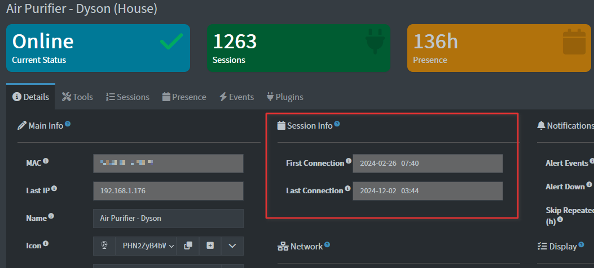

# Sessions Section – Device View

The **Sessions Section** shows a device’s connection history. All data is automatically detected and **cannot be edited**.

---

## Key Fields

| Field                          | Description                                                                                      | Editable?       |
| ------------------------------ | ------------------------------------------------------------------------------------------------ | --------------- |
| **First Connection**           | The first time the device was detected on the network.                                           | ❌ Auto-detected |
| **Last Connection**            | The most recent time the device was online.                                                      | ❌ Auto-detected |

---

## How Session Information Works

### 1. Detecting New Devices

* New devices are automatically detected when they first appear on the network.
* A **New Device** record is created, capturing the MAC, IP, vendor, and detection time.

### 2. Recording Connection Sessions

* Every time a device connects, a session entry is created.
* Captured details include:

  * Connection type (wired or wireless)
  * Connection time
  * Device details (MAC, IP, vendor)

### 3. Handling Missing or Conflicting Data

* **Triggers:**
  Devices are flagged when session data is incomplete, inconsistent, or conflicting. Examples include:

  * Missing first or last connection timestamps
  * Overlapping session records
  * Sessions showing a device as connected and disconnected at the same time

* **System response:**

  * Automatically highlights affected devices in the **Sessions Section**.
  * Attempts to **infer missing information** from available data, such as:

    * Estimating first or last connection times from nearby session events
    * Correcting overlapping session periods
    * Reconciling conflicting connection statuses

* **User impact:**

  * Users do **not** need to manually fix session data.
  * The system ensures the device’s connection history remains as accurate as possible for monitoring and reporting.

### 4. Updating Sessions

* **Reconnect:** Updates session with the new connection timestamp.
* **Disconnect:** Records disconnection time and marks the device as offline.

This session information feeds directly into **Monitoring → Presence**, providing a live view of which devices are currently online.

