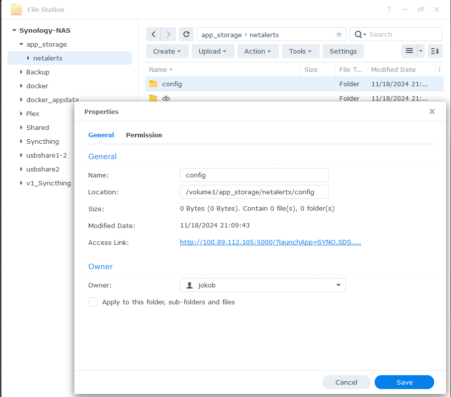
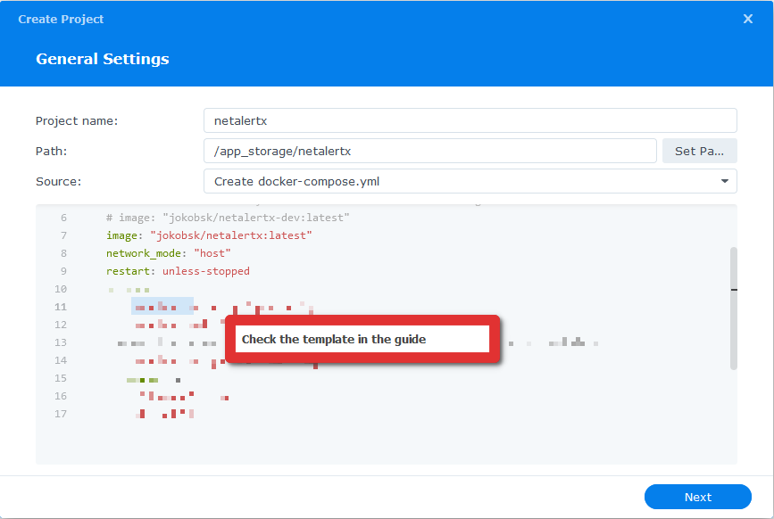
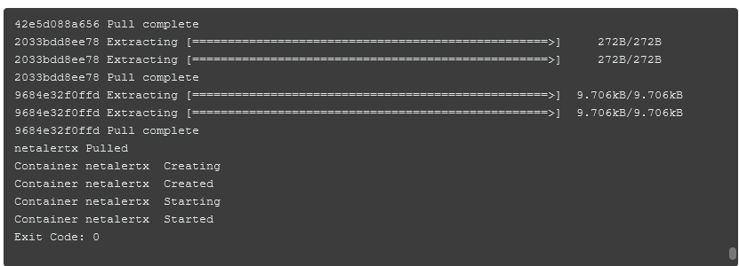

# Installation on a Synology NAS

There are different ways to install NetAlertX on a Synology, including SSH-ing into the machine and using the command line. For this guide, we will use the Project option in Container manager.

## Create the folder structure

The folders you are creating below will contain the configuration and the database. Back them up regularly.

1. Create a parent folder named `netalertx`
2. Create a `db` sub-folder

  
  
  

3. Create a `config` sub-folder

  

4. Note down the folders Locations:

  
  

## Creating the Project

1. Open **Container manager** -> **Project** and click **Create**.
2. Fill in the details:

- Project name: `netalertx`
- Path: `/app_storage/netalertx` (will differ from yours)
- Paste in the following template:


```yaml
services:
  netalertx:
    container_name: netalertx
    # use the below line if you want to test the latest dev image
    # image: "ghcr.io/jokob-sk/netalertx-dev:latest"
    image: "ghcr.io/jokob-sk/netalertx:latest"
    network_mode: "host"
    restart: unless-stopped
    cap_drop:       # Drop all capabilities for enhanced security
      - ALL
    cap_add:        # Re-add necessary capabilities
      - NET_RAW
      - NET_ADMIN
      - NET_BIND_SERVICE
    volumes:
      - /app_storage/netalertx:/data
      # to sync with system time
      - /etc/localtime:/etc/localtime:ro
    tmpfs:
      # All writable runtime state resides under /tmp; comment out to persist logs between restarts
      - "/tmp:uid=20211,gid=20211,mode=1700,rw,noexec,nosuid,nodev,async,noatime,nodiratime"
    environment:
      - PORT=20211
```

  

3. Replace the paths to your volume and comment out unnecessary line(s):

  - This is only an example, your paths will differ.

```yaml
volumes:
      - /volume1/app_storage/netalertx:/data
```

  

4. (optional) Change the port number from `20211` to an unused port if this port is already used.
5. Build the project:

  

10. Navigate to `<Synology URL>:20211` (or your custom port).
11. Read the [Subnets](./SUBNETS.md) and [Plugins](/docs/PLUGINS.md) docs to complete your setup.

## Solving permission issues

  See also the [Permission overview guide](./FILE_PERMISSIONS.md).

### Configuring the permissions via SSH

> [!TIP]
> If you are facing permissions issues run the following commands on your server. This will change the owner and assure sufficient access to the database and config files that are stored in the `/local_data_dir/db` and `/local_data_dir/config` folders (replace `local_data_dir` with the location where your `/db` and `/config` folders are located).
>
>  `sudo chown -R 20211:20211 /local_data_dir`
>
>  `sudo chmod -R a+rwx  /local_data_dir`
>

### Configuring the permissions via the Synology UI

You can also execute the above bash commands via the UI by creating a one-off scheduled task.

1. Control panel -> Task Scheduler
2. Create -> Scheduled Task -> User-defined Script

  

3. Give your task a name.

  

4. Specify one-off execution time (e.g. 5 minutes from now).

  

5. Paste the commands from the above SSH section and replace the `/local_data_dir` with the parent fodler of your `/db` and `/config` folders.

  

6. Wait until the execution time passes and verify the new ownership.

  


In case of issues, double-check the [Permission overview guide](./FILE_PERMISSIONS.md).
