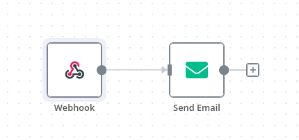
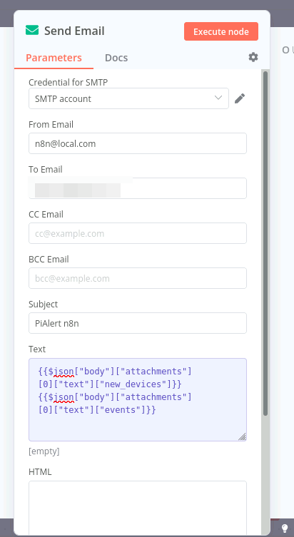
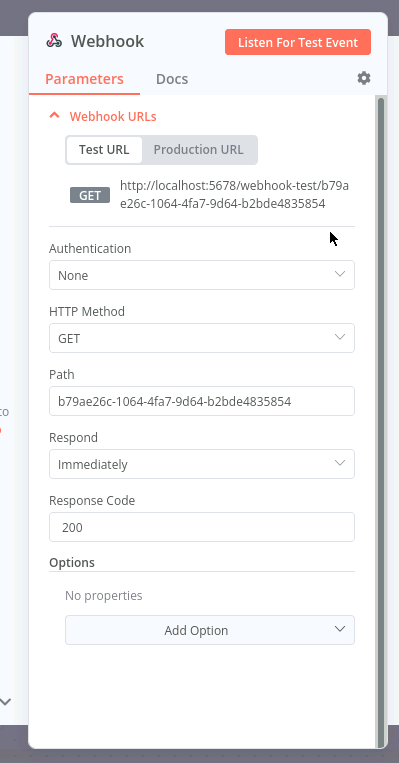

### Create a simple n8n workflow

> [!NOTE]
> You need to enable the `WEBHOOK` plugin first in order to follow this guide. See the [Plugins guide](./PLUGINS.md) for details.  

N8N can be used for more advanced conditional notification use cases. For example, you want only to get notified if two out of a specified list of devices is down. Or you can use other plugins to process the notifiations further. The below is a simple example of sending an email on a webhook.  



### Specify your email template 
See [sample JSON](https://github.com/jokob-sk/NetAlertX/blob/main/front/report_templates/webhook_json_sample.json) if you want to see the JSON paths used in the email template below


```
Events count: {{ $json["body"]["attachments"][0]["text"]["events"].length }}
New devices count: {{ $json["body"]["attachments"][0]["text"]["new_devices"].length }}
```

### Get your webhook in n8n


### Configure NetAlertX to point to the above URL

