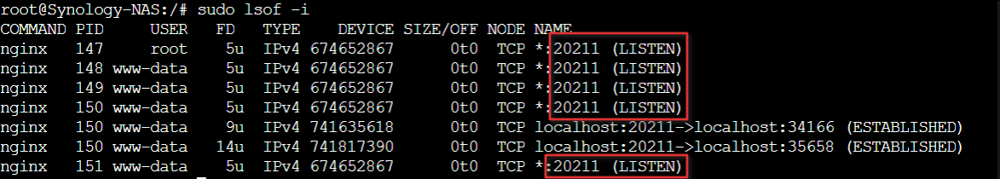

# Debugging inaccessible UI

The application uses the following default ports:

- **Web UI**: `20211`  
- **GraphQL API**: `20212`

The **Web UI** is served by an **nginx** server, while the **API backend** runs on a **Flask (Python)** server.

## Changing Ports

- To change the **Web UI** port, update the `PORT` environment variable in the `docker-compose.yml` file.
- To change the **GraphQL API** port, use the `GRAPHQL_PORT` setting, either directly or via Docker:
  ```yaml
  APP_CONF_OVERRIDE={"GRAPHQL_PORT":"20212"}
  ```

For more information, check the [Docker installation guide](./DOCKER_INSTALLATION.md).

## Possible issues and troubleshooting

Follow all of the below in order to disqualify potential causes of issues and to troubleshoot these problems faster.

### 1. Port conflicts

When opening an issue or debugging:

1. Include a screenshot of what you see when accessing `HTTP://<your rpi IP>/20211` (or your custom port)
1. [Follow steps 1, 2, 3, 4  on this page](./DEBUG_TIPS.md) 
1. Execute the following in the container to see the processes and their ports and submit a screenshot of the result:
   - `sudo apk add lsof`
   - `sudo lsof -i`
1. Try running the `nginx` command in the container:
   - if you get `nginx: [emerg] bind() to 0.0.0.0:20211 failed (98: Address in use)` try using a different port number




### 2. JavaScript issues 

Check for browser console (F12 browser dev console) errors + check different browsers.

### 3. Clear the app cache and cached JavaScript files

Refresh the browser cache (usually shoft + refresh), try a private window, or different browsers. Please also refresh the app cache by clicking the 🔃 (reload) button in the header of the application. 

### 4. Disable proxies

If you have any reverse proxy or similar, try disabling it. 

### 5. Disable your firewall

If you are using a firewall, try to temporarily disabling it. 

### 6. Post your docker start details

If you haven't, post your docker compose/run command.

### 7. Check for errors in your PHP/NGINX error logs

In the container execute and investigate:

`cat /var/log/nginx/error.log`

`cat /tmp/log/app.php_errors.log`

### 8. Make sure permissions are correct

> [!TIP]
> You can try to start the container without mapping the `/data/config` and `/data/db` dirs and if the UI shows up then the issue is most likely related to your file system permissions or file ownership. 

Please read the [Permissions troubleshooting guide](./FILE_PERMISSIONS.md) and provide a screesnhot of the permissions and ownership in the `/data/db` and `app/config` directories. 