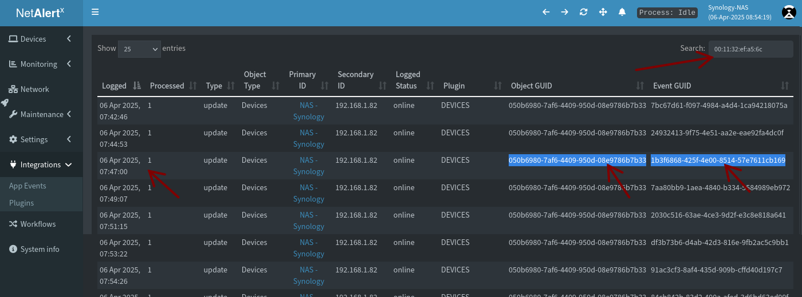
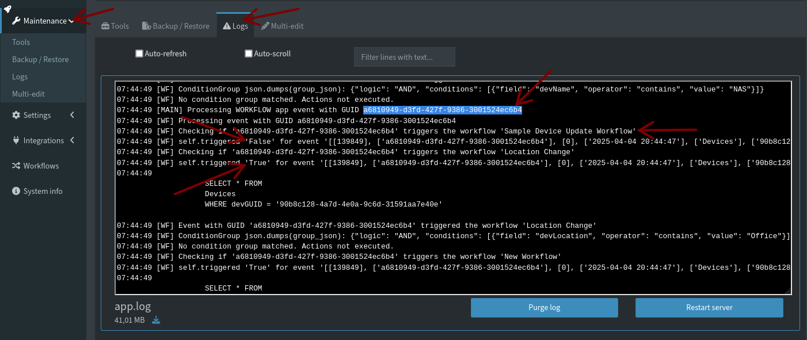

# Workflows debugging and troubleshooting

> [!TIP]
> Before troubleshooting, please ensure you have [Debugging enabled](./DEBUG_TIPS.md).

Workflows are triggered by various events. These events are captured and listed in the _Integrations -> App Events_ section of the application. 

## Troubleshooting triggers

> [!NOTE]
> Workflow events are processed once every 5 seconds. However, if a scan or other background tasks are running, this can cause a delay up to a few minutes. 

If an event doesn't trigger a workflow as expected, check the _App Events_ section for the event. You can filter these by the ID of the device (`devMAC` or `devGUID`). 



Once you find the _Event Guid_ and _Object GUID_, use them to find relevant debug entries. 

Navigate to _Mainetenace -> Logs_ where you can filter the logs based on the _Event or Object GUID_. 



Below you can find some example `app.log` entries that will help you understand why a Workflow was or was not triggered.

```bash
16:27:03 [WF] Checking if '13f0ce26-1835-4c48-ae03-cdaf38f328fe' triggers the workflow 'Sample Device Update Workflow'
16:27:03 [WF] self.triggered 'False' for event '[[155], ['13f0ce26-1835-4c48-ae03-cdaf38f328fe'], [0], ['2025-04-02 05:26:56'], ['Devices'], ['050b6980-7af6-4409-950d-08e9786b7b33'], ['DEVICES'], ['00:11:32:ef:a5:6c'], ['192.168.1.82'], ['050b6980-7af6-4409-950d-08e9786b7b33'], [None], [0], [0], ['devPresentLastScan'], ['online'], ['update'], [None], [None], [None], [None]] and trigger {"object_type": "Devices", "event_type": "insert"}' 
16:27:03 [WF] Checking if '13f0ce26-1835-4c48-ae03-cdaf38f328fe' triggers the workflow 'Location Change'
16:27:03 [WF] self.triggered 'True' for event '[[155], ['13f0ce26-1835-4c48-ae03-cdaf38f328fe'], [0], ['2025-04-02 05:26:56'], ['Devices'], ['050b6980-7af6-4409-950d-08e9786b7b33'], ['DEVICES'], ['00:11:32:ef:a5:6c'], ['192.168.1.82'], ['050b6980-7af6-4409-950d-08e9786b7b33'], [None], [0], [0], ['devPresentLastScan'], ['online'], ['update'], [None], [None], [None], [None]] and trigger {"object_type": "Devices", "event_type": "update"}' 
16:27:03 [WF] Event with GUID '13f0ce26-1835-4c48-ae03-cdaf38f328fe' triggered the workflow 'Location Change'
```

Note how one trigger executed, but the other didn't based on different `"event_type"` values. One is `"event_type": "insert"`, the other `"event_type": "update"`.

Given the Event is a update event (note `...['online'], ['update'], [None]...` in the event structure), the `"event_type": "insert"` trigger didn't execute.


