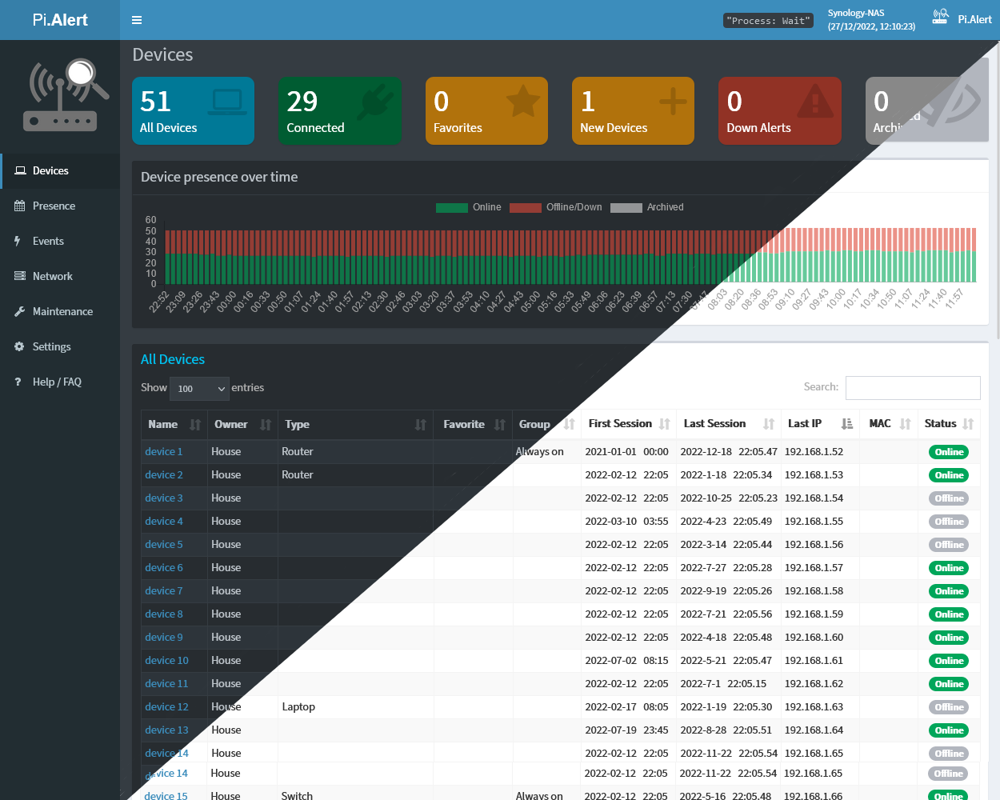

---
hide:
  - navigation
  - toc
---

# NetAlertX Documentation

Welcome to the official NetAlertX documentation! NetAlertX is a powerful tool designed to simplify the management and monitoring of your network. Below, you will find guides and resources to help you set up, configure, and troubleshoot your NetAlertX instance.

## In-App Help

NetAlertX provides contextual help within the application:

- **Hover over settings, fields, or labels** to see additional tooltips and guidance.
- **Click ❔ (question-mark) icons** next to various elements to view detailed information.

---

## Installation Guides

The app can be installed different ways, with the best support of the docker-based deployments. This includes the Home Assistant and Unraid installation approaches. See details below.

### Docker (Fully Supported)

NetAlertX is fully supported in Docker environments, allowing for easy setup and configuration. Follow the official guide to get started:

- [Docker Installation Guide](./DOCKER_INSTALLATION.md)

This guide will take you through the process of setting up NetAlertX using Docker Compose or standalone Docker commands.

### Home Assistant (Fully Supported)

You can install NetAlertX also as a Home Assistant addon  via the [alexbelgium/hassio-addons](https://github.com/alexbelgium/hassio-addons/) repository. This is only possible if you run a supervised instance of Home Assistant. If not, you can still run NetAlertX in a separate Docker container and follow this guide to configure MQTT.

- [[Installation] Home Assistant](https://github.com/alexbelgium/hassio-addons/tree/master/netalertx)

### Unraid (Partial Support)

The Unraid template was created by the community, so it's only partially supported. Alternatively, here is [another version of the Unraid template](https://github.com/jokob-sk/NetAlertX-unraid).

- [[Installation] Unraid App](https://unraid.net/community/apps)

### Bare-Metal Installation (Experimental)

If you prefer to run NetAlertX on your own hardware, you can try the experimental bare-metal installation. Please note that this method is still under development, and are looking for maintainers to help improve it.

- [Bare-Metal Installation Guide](./HW_INSTALL.md)

---

## Help and Support

If you need help or run into issues, here are some resources to guide you:

**Before opening an issue, please:**

  - [Check common issues](./DEBUG_TIPS.md#common-issues) to see if your problem has already been reported.
  - [Look at closed issues](https://github.com/jokob-sk/NetAlertX/issues?q=is%3Aissue+is%3Aclosed) for possible solutions to past problems.
  - **Enable debugging** to gather more information: [Debug Guide](./DEBUG_TIPS.md).

**Need more help?** Join the community discussions or submit a support request:

  - Visit the [GitHub Discussions](https://github.com/jokob-sk/NetAlertX/discussions) for community support.
  - If you are experiencing issues that require immediate attention, consider opening an issue on our [GitHub Issues page](https://github.com/jokob-sk/NetAlertX/issues).

---

## Contributing

NetAlertX is open-source and welcomes contributions from the community! If you'd like to help improve the software, please follow the guidelines below:

- **Fork the repository** and make your changes.
- **Submit a pull request** with a detailed description of what you’ve changed and why.

For more information on contributing, check out our [Dev Guide](./DEV_ENV_SETUP.md).

---

## Stay Updated

To keep up with the latest changes and updates to NetAlertX, please refer to the following resources:

- [Releases](https://github.com/jokob-sk/NetAlertX/releases)

Make sure to follow the project on GitHub to get notifications for new releases and important updates.

---
## Additional info

- **Documentation Index**: Check out the full [documentation index](https://github.com/jokob-sk/NetAlertX/tree/main/docs) for all the guides available.

If you have any suggestions or improvements, please don’t hesitate to contribute!

NetAlertX is actively maintained. You can find the source code, report bugs, or request new features on our [GitHub page](https://github.com/jokob-sk/NetAlertX).
