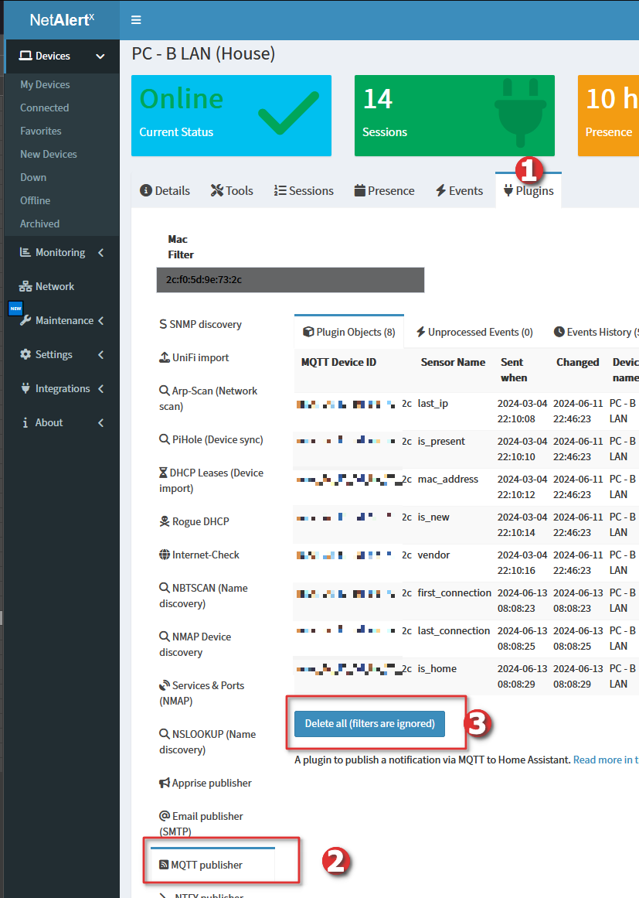

# Overview

- Feed your data and device changes into [Home Assistant](https://docs.netalertx.com/HOME_ASSISTANT) via the MQTT Mosquito broker (other brokers might work as well).

# Usage

- Go to settings and fill in relevant details. There are 2 types of "devices" generated and sent to the broker. A generic overview device that contains online/down/archived device stats and then the actual devices detected by the application.


## Forcing an update

In order to speed up the processing, device configs are only pushed to the broker if a change occurs. The plugin compares the previous data with the current device state, and the following fields are checked:

- icon
- device name
- mac

You can force an update of all devices by deleting plugin objects of the MQTT plugin. For example, navigate to:

`Device -> Plugins -> MQTT -> Delete all`

Filters will be ignored, and this will delete all objects associated with the plugin. The next time the MQTT plugin is processed, all data is re-sent to the broker.



Please note the online/offline state of the device is always updated based on the scan result and if it changed from the previous value.


# Sample Payloads


>[!WARNING]
> Please check your Home Assistant MQTT broker debug info for the most up-to-date data and format as the below might be outdated.

## Overview device

The below payloads apply to the device showing overall online/down/archived stats. You can toggle them on/off with the `SEND_STATS` setting.

### MQTT discovery data:

>[!NOTE]
> You can replace the `netalertx` string of the below topic via the `DEVICE_ID` setting.

Topic: `homeassistant/sensor/netalertx/online/config`


>[!NOTE]
> You can replace the `"name": "NetAlertX"` string of the below payload via the `DEVICE_NAME` setting.

Payload:

```json
{
  "name": "online",
  "state_topic": "system-sensors/sensor/netalertx/state",
  "value_template": "{{value_json.online}}",
  "unique_id": "netalertx_sensor_online",
  "device": {
    "identifiers": [
      "netalertx_sensor"
    ],
    "manufacturer": "NetAlertX",
    "name": "NetAlertX"
  },
  "icon": "mdi:wifi-check",
  "platform": "mqtt"
}
```

### MQTT config data sample:

>[!NOTE]
> You can replace the `netalertx` string of the below topic via the `DEVICE_ID` setting.

Topic: `homeassistant/sensor/netalertx/all/config`

Payload:

```json
{
  "name": "all",
  "state_topic": "system-sensors/sensor/netalertx/state",
  "value_template": "{{value_json.all}}",
  "unique_id": "netalertx_sensor_all",
  "device": {
    "identifiers": [
      "netalertx_sensor"
    ],
    "manufacturer": "NetAlertX",
    "name": "NetAlertX"
  },
  "icon": "mdi:wifi",
  "platform": "mqtt"
}
```


### MQTT state data:

>[!NOTE]
> You can replace the `netalertx` string of the below topic via the `DEVICE_ID` setting.

Topic: `system-sensors/sensor/netalertx/state`

Payload:

```json
{
  "online": 30,
  "down": 36,
  "all": 66,
  "archived": 0,
  "new": 0,
  "unknown": 0
}
```


## Individual devices

The below payloads apply to individual devices. Every device discovered by the application will generate the below messages. You can toggle them on/off with the `SEND_DEVICES` setting.

### MQTT discovery data:

Topic: `homeassistant/sensor/mac_44_ef_44_ef_44_ef/last_ip/config`

Payload:

```json

{
  "name": "last_ip",
  "state_topic": "system-sensors/sensor/mac_44_ef_44_ef_44_ef/state",
  "value_template": "{{value_json.last_ip}}",
  "unique_id": "mac_44_ef_44_ef_44_ef_sensor_last_ip",
  "device": {
    "identifiers": [
      "mac_44_ef_44_ef_44_ef_sensor"
    ],
    "manufacturer": "NetAlertX",
    "name": "Camera - E1"
  },
  "icon": "mdi:ip-network",
  "platform": "mqtt"
}

```

### MQTT state data:

Topic: `system-sensors/sensor/mac_44_ef_44_ef_44_ef/state`

Payload:

```json
{
  "last_ip": "192.168.1.33",
  "is_new": "0",
  "vendor": "None",
  "mac_address": "44:ef:44:ef:44:ef"
}
```

### Transmitted message examples:

Topic: `homeassistant/binary_sensor/mac_44_ef_44_ef_44_ef/is_present/`

Payload:

```json
{
  "name": "is_present",
  "state_topic": "system-sensors/binary_sensor/mac_44_ef_44_ef_44_ef/state",
  "value_template": "{{value_json.is_present}}",
  "unique_id": "mac_44_ef_44_ef_44_ef_sensor_is_present",
  "device": {
    "identifiers": [
      "mac_44_ef_44_ef_44_ef_sensor"
    ],
    "manufacturer": "NetAlertX",
    "name": "Camera - E1"
  },
  "icon": "mdi:wifi",
  "platform": "mqtt"
}
```

Topic: `system-sensors/binary_sensor/mac_44_ef_44_ef_44_ef/state`

Payload:

```json
{
  "is_present": "OFF"
}
```

```json
{
  "is_present": "ON"
}
```


## Implementation Notes

The first run will take a while, subsequent should be much faster because new sensors don't have to be created anymore. If the first sync times out, try to increase the timeout setting (default: 10s per device). A bit of background:

1. The app keeps a hash of the sensors. The hash includes:
    - deviceId: Unique identifier for the device associated with the sensor.
    - deviceName: Name of the device.
    - sensorType: Type of sensor.
    - sensorName: Name of the sensor.
    - icon: Icon associated with the sensor.
2. This hash is compared to existing MQTT plugin object hashes, which can be found under Integrations > Plugins > MQTT (Plugin objects tab) > Hash
3. If the hash is not found, a new device/device state is assumed and the device is sent to the broker


The state is managed differently, the state of the sensor is not included in the hash. This might be improved upon in later releases.
