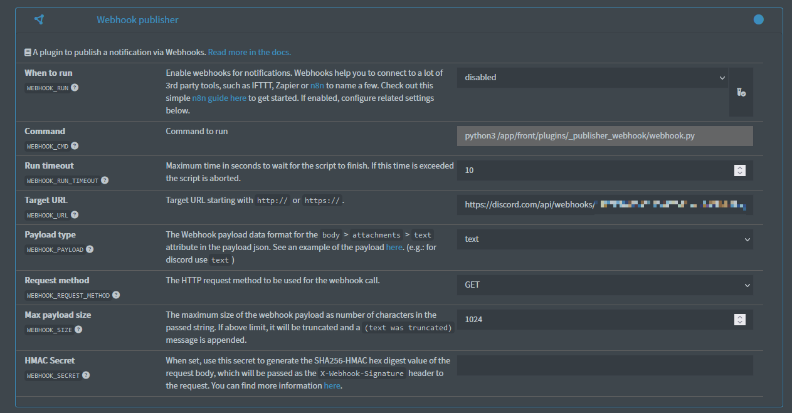

## Overview

A plugin to publish a notification via the Webhook gateway. Webhooks help you to connect to a lot of 3rd party tools, such as IFTTT, Zapier or <a href="https://n8n.io/" target="_blank">n8n</a> to name a few. Check out this simple <a href="https://docs.netalertx.com/WEBHOOK_N8N" target="_blank">n8n guide here</a> to get started. If enabled, configure related settings below.

### Usage

- Go to settings and fill in relevant details.

#### Sample Discord Setup

