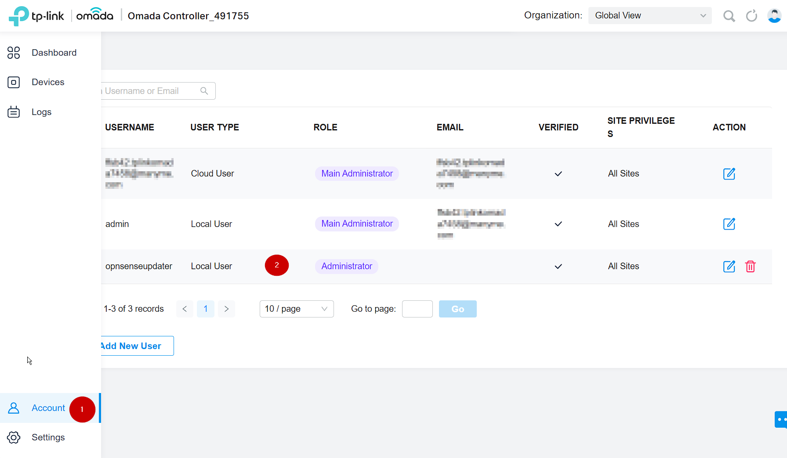

## Overview

> [!WARNING]
> UNMAINTAINED - Looking for maintainers. If possible, use the `OMDSDNOPENAPI` instead.

The OMADA SDN plugin aims at synchronizing data between NetAlertX and a TPLINK OMADA SND controler by leveraging a tplink omada python library.

#### Features

1. extract list of OMADA Clients from OMADA and sync them up with NetAlertX
2. extract list of OAMDA Devices (switches and access points) and sync them up with NetAlertX

> [!TIP]
> Some omada devices are apparently not fully compatible with the API which might lead to partial results.

### Quick setup guide

1. You SHOULD (ie: strongly recommend) set up an account in your OMADA SDN console dedicated to NetAlertX OMADA_SDN plugin.
- you should set USER TYPE = Local User
- you should set USER ROLE = Administrator  (if you use a read-only role you won't be able to sync names from NetAlerX to OMADA SDN)
- you can set  Site Privileges = All Sites (or limit it to specific sites )

2. populate the variables in NetAlertX as instructed in the config plugin page.

#### Required Settings

- `OMDSDN_url`
- `OMDSDN_sites`
- `OMDSDN_username`
- `OMDSDN_password` (if using special characters, make sure they are python-friendly (e.g. `~`))
- `OMDSDN_force_overwrite`

### Usage

- Head to **Settings** > **Plugin name** to adjust the default values.

### Notes

#### features not implemented yet:
3. Extract list of OAMDA router Devices (er605...) and sync them up with NetAlertX 
(I need to setup my own er605 however due to its limitations I have no use for it, and due to limitations of opensense dhcp servers, I can't deploy it yet without breaking dhcp self registration into opnsense unbound - see below)
 
#### know limitations:
OMADA SDN limitation fixed by the plugin:
0. OMADA SDN can't use DNS for names and keep using MAC ref: https://community.tp-link.com/en/business/forum/topic/503782
- when you use an OMADA user Role =  Administrator, the plugin will attempt to fix OMADA's shortcoming and populat the NAME field from NetAlertX (from DNS/DHCP/...)

can not fix some of tplinks OMADA SDN own limitations/bugs:
1. OMADA SDN switches uplinks/downlinks is broken if the default router is not an OMADA native device 
- (I try to circumvent that through a tree parsing heuristic but your mileage might vary...)
- ref: https://community.tp-link.com/en/business/forum/topic/673628
2.  OMADA SDN clients are sometimes mapped to the wrong switch/port... for instance:
- client -> access_switch1/port1 -> core_switch2/port2 sometimes shows as client -> core_switch2/port2 
- it is unclear if this issue is realted to (1)
3. OMADA er605 routers do not self register DHCP names with a remote unbound DNS (nor embded DNS):
- ref:  https://community.tp-link.com/en/business/forum/topic/542472
- it looks like some release candidate firmware might provide this feature... I will test when opnsesne Kea self registration get fixed as well(4)and I can get it dhcp proxy to work.
4. Opnsense dhcp doesn't support relay and self-registration at the same time...
- opnsense legacy ISC dhcp server doesn't support dhcp  proxies:  ref: https://forum.opnsense.org/index.php?topic=34254.0 
- opnsense new kea dhcp server doesn't support dns self registration (yet) ref: https://github.com/opnsense/core/pull/7362
5. incompatible devices: 
- OMADA EAP245 - to be fair to tp-link, this access point works inside OMADA SDN, so it might be an issue with our omada python library but we can't extract data from it.

## Other info

- Version: 1.0
- Author : [Flying Toto](https://github.com/FlyingToto) + [Leicas](https://github.com/Leicas)
- Release Date: 04-Jul-2024 
